# UZ's Hideous Destructor Addon

This is my personal collection of recolor/resprite/resound assets for the GZDoom gameplay mod, "Hideous Destructor".  As it's my personal collection of changes, there are several various mods it makes changes to.

---
## Sprite Changes

### Monster Sprite Changes

#### Imp Variants

When playing id Doom, the three main imp variants (Fighter, Mage, and Healer) now have more distinct color palettes.  
_Credits: Karla_  

#### Ghost Squadron

When playing id Doom, the ghost squadron translation has been updated to match the rest of the reskin thematically.

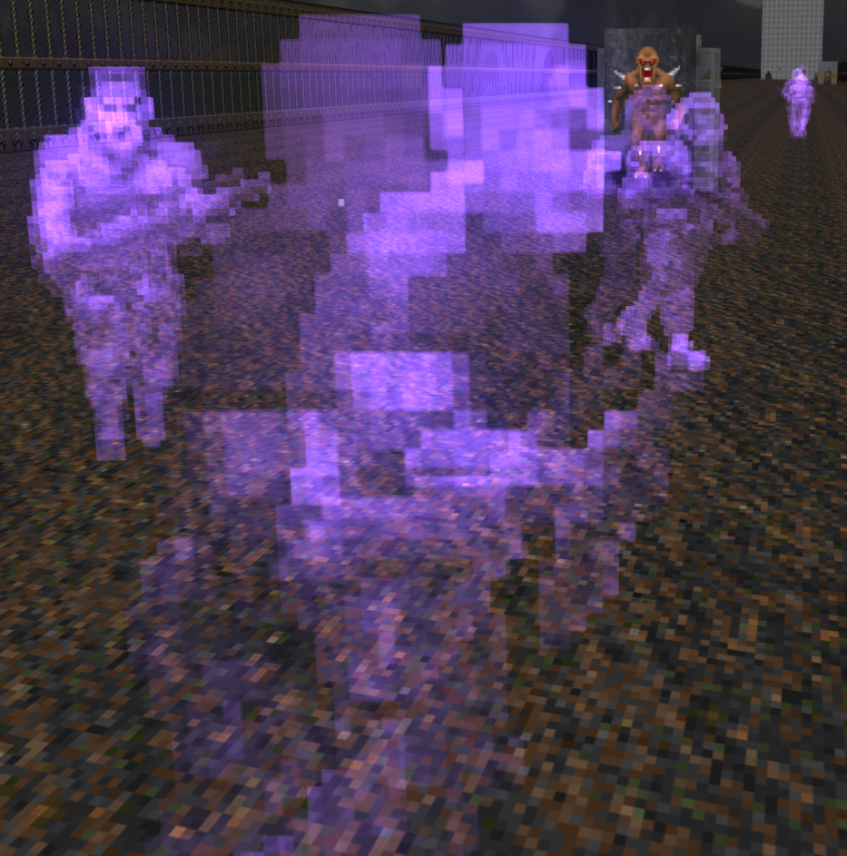

#### Ninja Pirates

When playing id Doom, the ninja pirate has been replaced with a recolored version of Hell-Forged's Brute, to match the anomalous nature of this beast's ability to phase in and out of visible perception.

  
_Credits: Project Malice Team, Eriance/Amuscaria_

#### Hell Nobles

When playing id Doom, the Hell Knight & Baron of Hell have been replaced with recolored versions to give them a darker, spookier appearance.

_Credits:_  
_Hell Knight: Project Malice Team, id Software_  
_Baron of Hell: Gifty & Vdude (from Supercharge), Skulltag Team, id Software_

#### Cacodemon

When playing id Doom, the cacodemon's death animation has been replaced with one that feels much more electrifying, given their proclivity to emit sparks when dead.

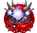  
_Credits: Robo_Cola, id Software_

#### Melee Zombies
_Requires [Radtech Zombies](https://github.com/swampyrad/RadTechZombies)_

While playing id Doom, the melee zombie has been replaced with a more "fitting" id Doom Zombieman, with matching translations.

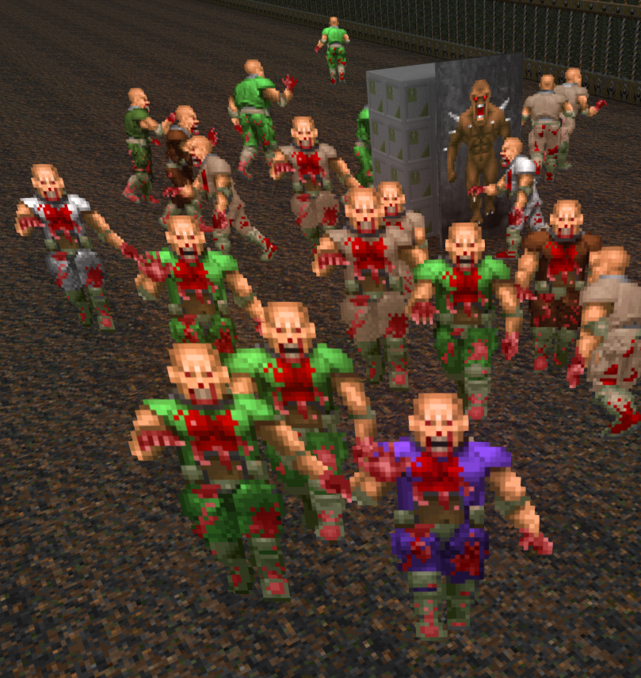  
_Credits: ShallowB, Solmyr, Metal_Spaghetti, OSJClatchford_

---
### Weapon Sprite Changes
_Note: Some weapons included have the crosshair color "baked" into the sprite, and for those weapons I have taken the liberty of tweaking the in-game sprite to match my personal crosshair color.  If you would like your crosshair color to match, simply update the color in the main GZDoom options menu to `#673ab7`_

#### Recolored Ironsights

##### Vanilla Hideous Destructor
- Default Hideous Destructor Front & Back Ironsights  
  _Credits: Matt_

##### Peppergrinder
- HLAR 9mm AR Front Ironsight  
  _Credits: Ultra64_
- BPX 9mm Carbine Rifle Back Ironsight  
  _Credits: A1337Spy_
- Sig-Cow 10mm Carbine Rifle Back Ironsight  
  _Credits: Swampyrad_
- TRO-G AR Front Ironsight  
  _Credits: A1337Spy, HyperUltra64, Sledge, Chopblock223_

#### Fists
The fists have been swapped out with a set that use plain Doomguy Gloves, simply for consistency.

_Credits: [UNKNOWN](#UNKNOWN-CREDITS)_

#### Pistols
_Requires [Radtech Weapons Pack](https://github.com/swampyrad/RadTechWeaponsPack)_

The pistol has been swapped out with Glock18 sprites, then recolored to match thematically.  The "Quick Swap" set of sprites have the pistol correctly flipped, as well.

  
_Credits:  
HUD Sprites: TommyGalano5, JoeyTD & Minigunner ([Realm667](https://www.realm667.com/en/armory-mainmenu-157-97317/doom-style-mainmenu-158-94349/996-glock-18))  
Pickup Sprites: TommyGalano5  
Fireselect Graphic: Combine Kegan_  

  
_Credits:  
HUD Sprites: TommyGalano5, JoeyTD & Minigunner ([Realm667](https://www.realm667.com/en/armory-mainmenu-157-97317/doom-style-mainmenu-158-94349/996-glock-18))  
Pickup Sprites: TommyGalano5_  

#### Revolvers
_Scoped Revolver requires [Peppergrinder](https://gitlab.com/hdiscord-saltmines/hd-peppergrinder)_

The Revolver's main body and Ironsights have been recolored, which also applies to the Peppergrinder Scoped Revolver.

  
  
_Credits:  
Revolver Base: Scuba Steve  
Scope: PrettyFist, Sonik.O_

#### SMG

The SMG has been swapped out with something a bit more modern and sleek, as well as have its ironsights variant recolored for thematic consistency.

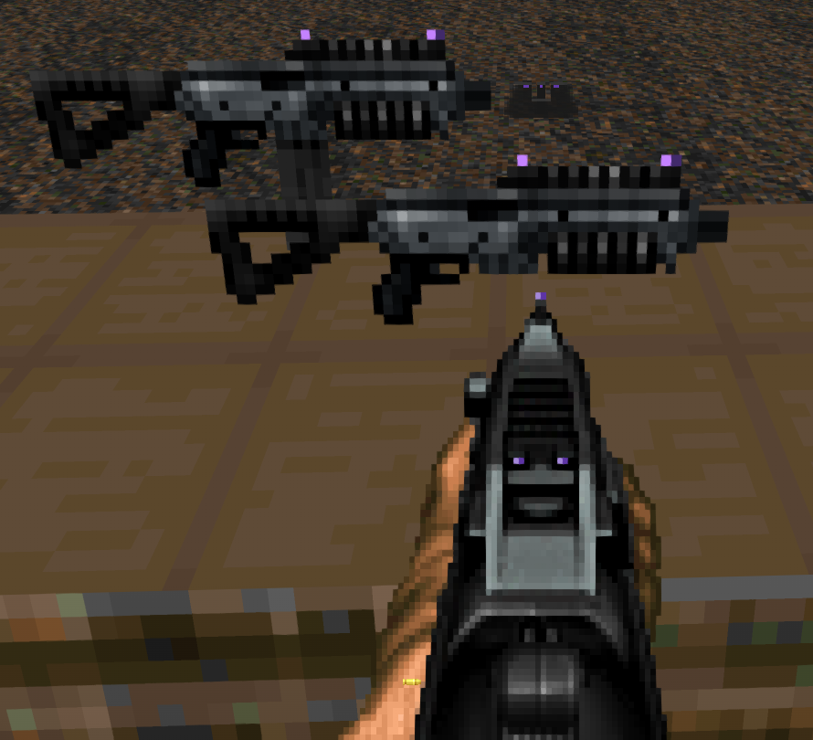  
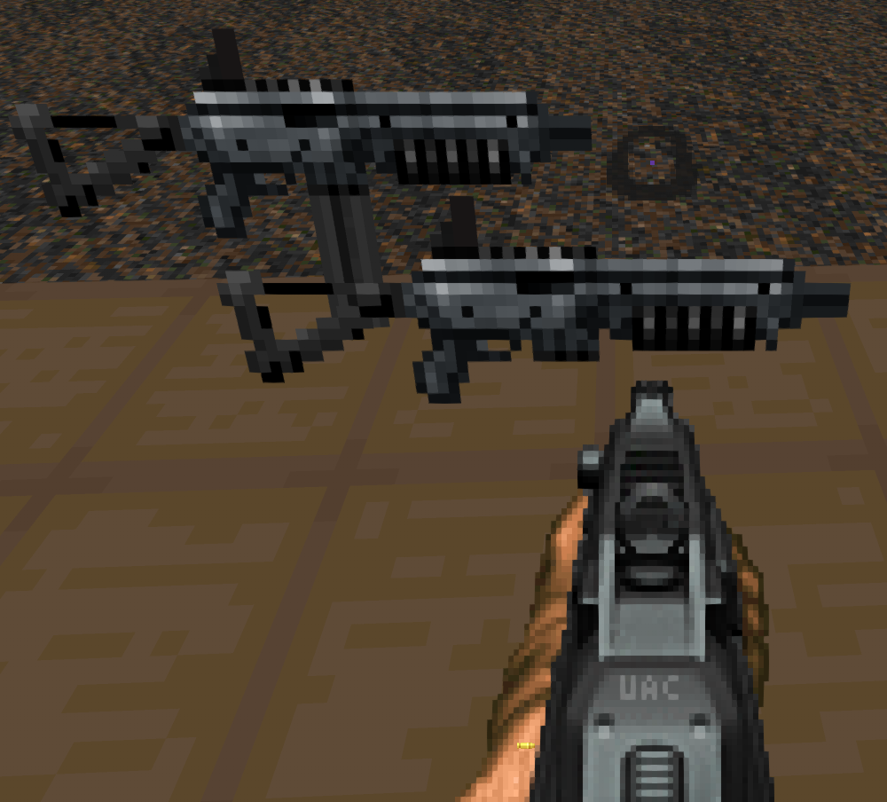  
_Credits:  
HUD Sprites: vitriolicv, ZikShadow, Jeimuzu, DoomNukem  
Pickup Sprites: vitriolicv, ZikShadow, DoomNukem_

#### Arkoudi Revolver Shotgun
_Arkoudi Revolver Shotgun requires [Potetobloke's Bangers & Mash](https://github.com/Potetobloke/PB_HDAddon_Bangers-And-Mash.git)_

The Arkoudi Revolver Shotgun's ironsights have been recolored.

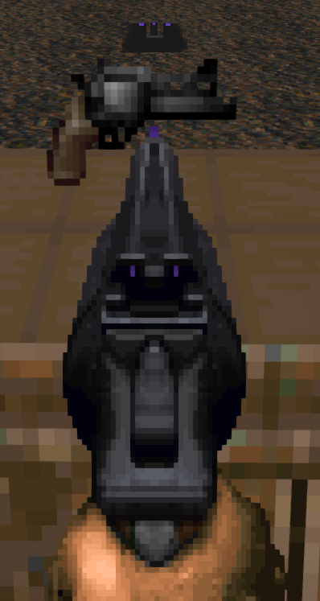  
_Credits: AdianoTMO69_

#### Hunter Shotgun
The hunter has been swapped out with a set that looks like the ones made by Daedalus' Complex Doom, yet still keep more of a vanilla feel to it, then recolored to match thematically.

  
_Credits:  
HUD Sprites: Sonik.O, Neoworm  
Pickup Sprite: Matt, Sonik.O_

#### Slayers
_Sawed-Off & Scoped Slayers require [Peppergrinder](https://gitlab.com/hdiscord-saltmines/hd-peppergrinder)_

The Slayers have been swapped out with a more detailed, yet still vanilla-like design.

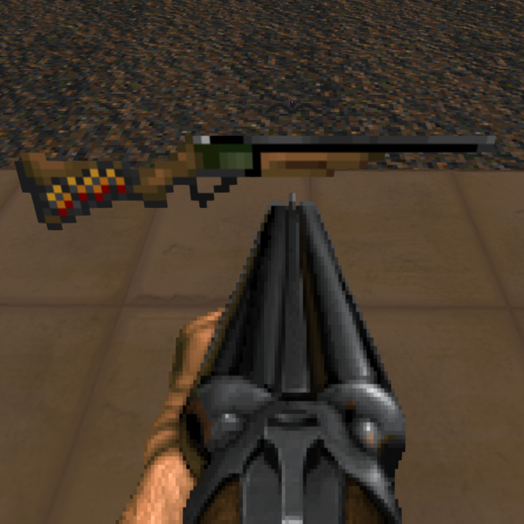  
_Credits: TommyGalano5, id Software, CardboardMarty, JoeyTD, Neoworm, YukesVonFaust, Sonik.O, ChopBlock223_

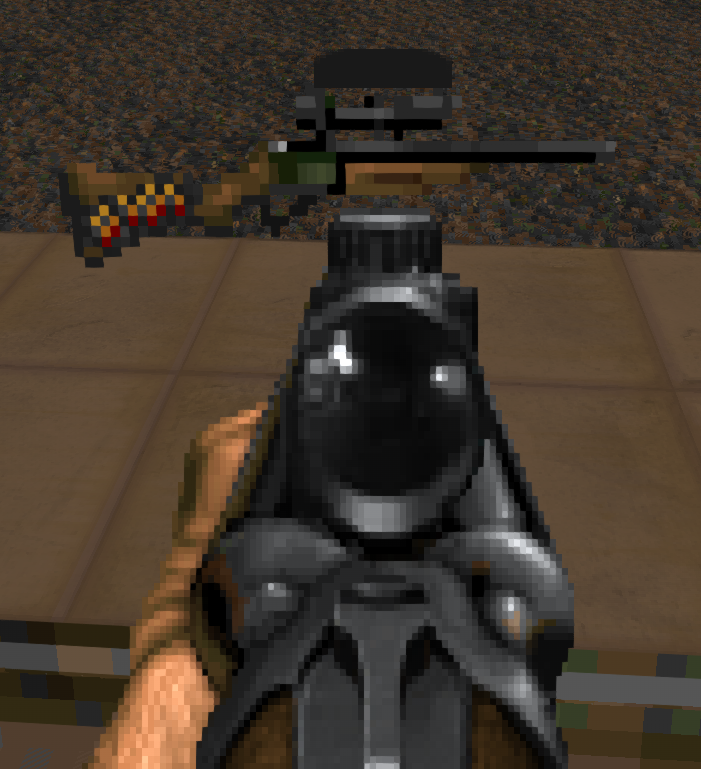  
_Credits: TommyGalano5, id Software, CardboardMarty, JoeyTD, Neoworm, YukesVonFaust, Sonik.O, ChopBlock223, A1337Spy, Potetobloke_

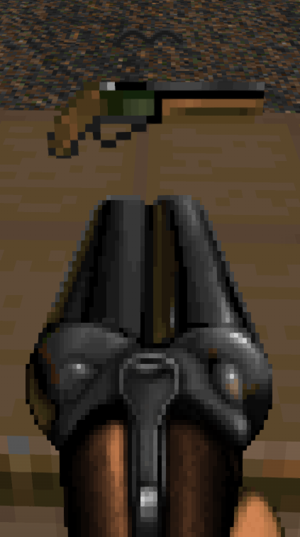  
_Credits: TommyGalano5, id Software, CardboardMarty, JoeyTD, Neoworm, YukesVonFaust, Sonik.O, ChopBlock223_

#### ZM-66 Assault Rifle
The ZM-66 has been swapped out with an older version of its HUD & pickup sprites, then had its scope lens recolored to match thematically.

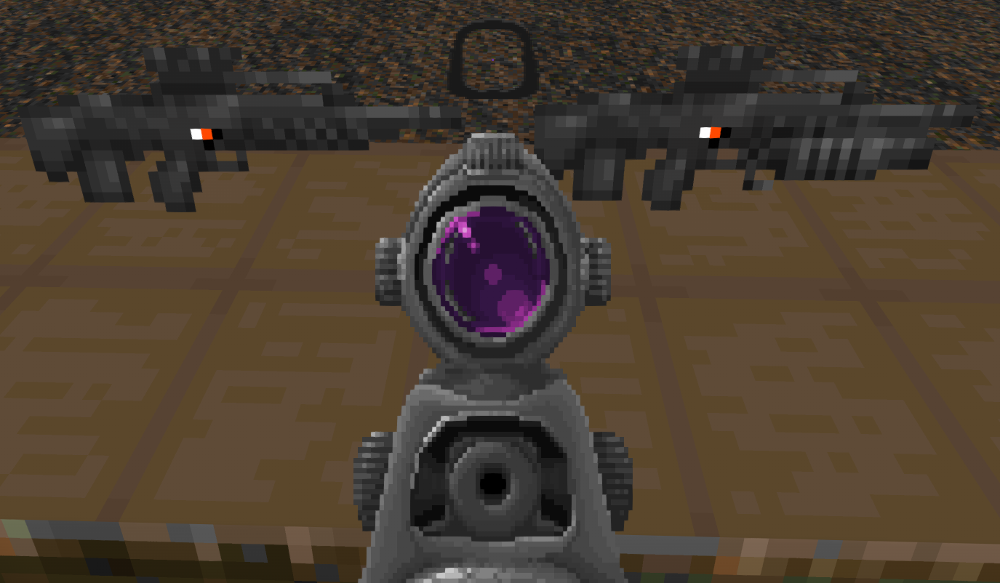  
_Credits:  
HUD & Pickup Sprites: Matt  
Fireselect Graphic: Combine Kegan_

#### Vulcanette
The Vulcanette has been swapped out to give it a much more fitting, hefty minigun feeling.

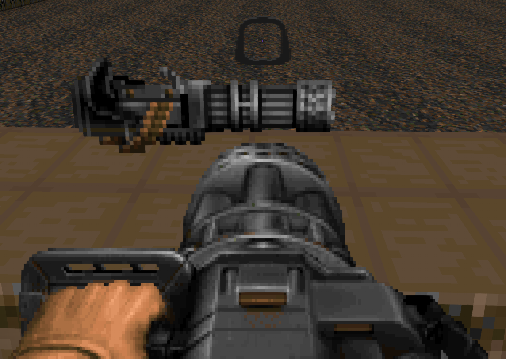  
_Credits: Sonik.O_

H.E.R.P. Changes
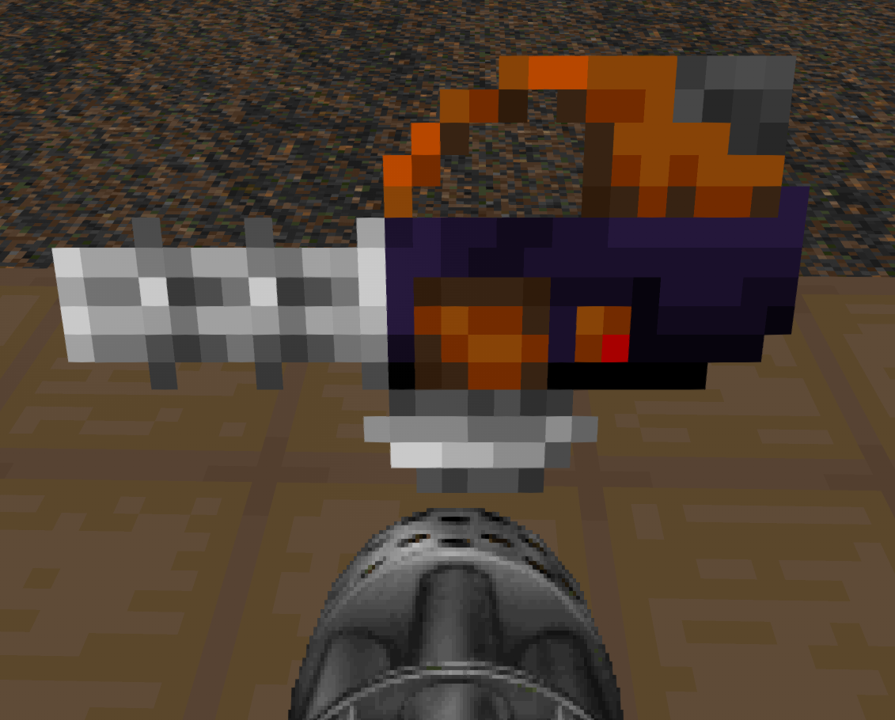  

#### Liberator Battle Rifle
The Liberator has been swapped out with an older version of its HUD & pickup sprites, then had its scope lens recolored to match thematically.

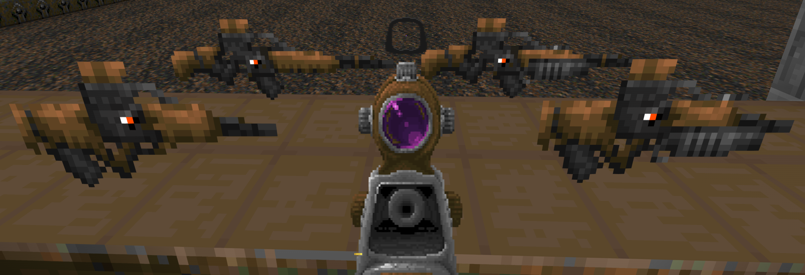  
_Credits:  
HUD & Pickup Sprites: Matt  
Fireselect Graphic: Combine Kegan_

#### Rocket Launcher
The Rocket Launcher has been swapped out with something a recoil-less rifle in the form of the Direct Hit, which has been adjusted to account for the extended mag option.

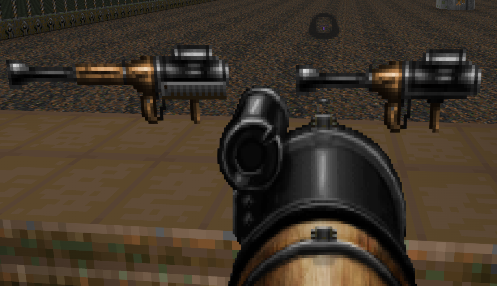  
_[DRLA Credits](#DRLA-Credits):_  
_Direct Hit Sprites: PillowBlaster ([DRLA](https://forum.zdoom.org/viewtopic.php?t=37044))_  
_Extended Mag addon: Sonik.O_

#### Blooper Grenade Launcher
The Blooper has been swapped out for a Break-Action Grenade Launcher by Sonik.O.

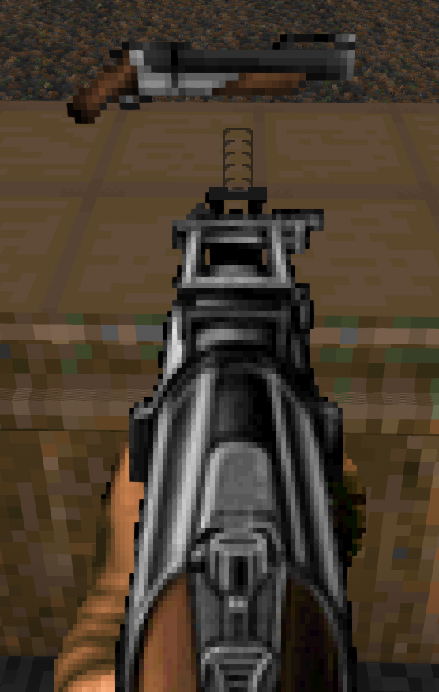  
_Credits: Sonik.O_

#### Brontornis
The Brontornis Rifle has been swapped out for something with a bit better perspective, as well as fitting the overall aesthetic of the rest of the pack.

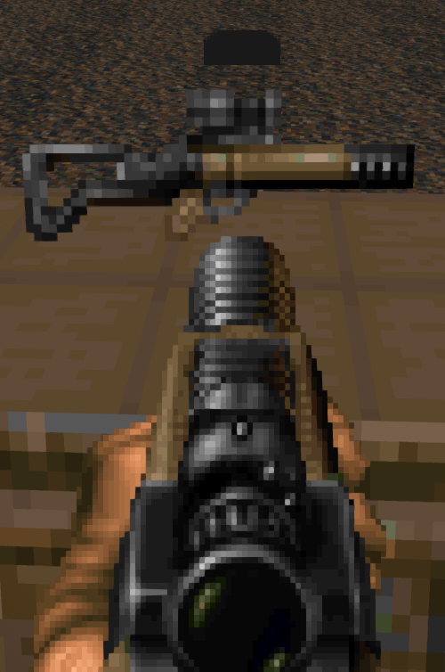  
_Credits: Sonik.O_

#### BFG-9000
The BFG-9000 Has been swapped out for one that still feels like a BFG, but one that fits the overall aesthetic a bit better.

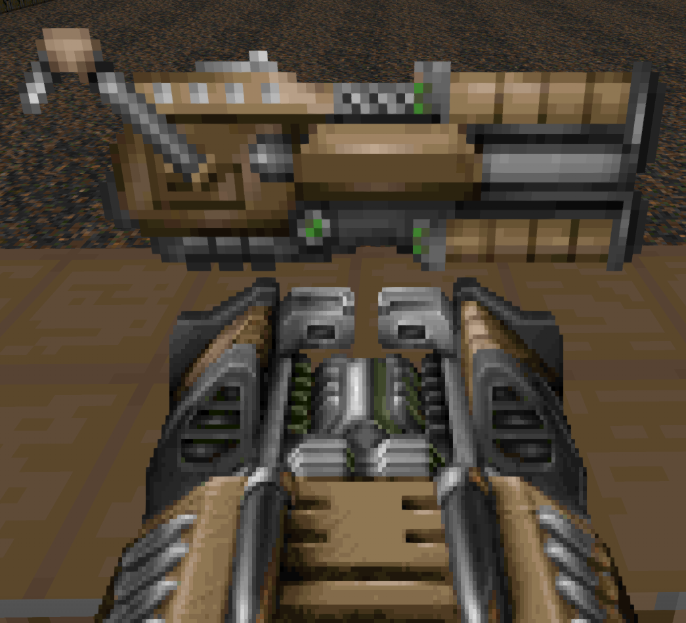  
_Credits: Sonik.O, 3D Realms_

#### Altis O/U Shotgun
The Altis O/U Shotgun has had its reloading frames swapped out with a fresh set made by TommyGalano5.

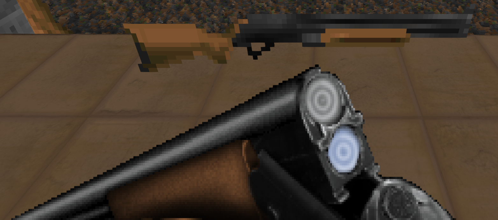
_Credits: TommyGalano5_

#### 10mm Pistol
_Requires [Radtech Weapons Pack](https://github.com/swampyrad/RadTechWeaponsPack)_

The 10mm Pistol's rear Ironsight dots have been recolored to match the default Sight sprites.

  
_Credits:  
HUD & Pkcup Sprites: Chopblock223, [Freedoom](https://freedoom.github.io/)  
Fireselect Graphic: Combine Kegan_

#### Phazer
_Requires [Radtech Weapons Pack](https://github.com/swampyrad/RadTechWeaponsPack)_

The Phazer has been swapped out with a more fitting D-93 Plasma Pistol.

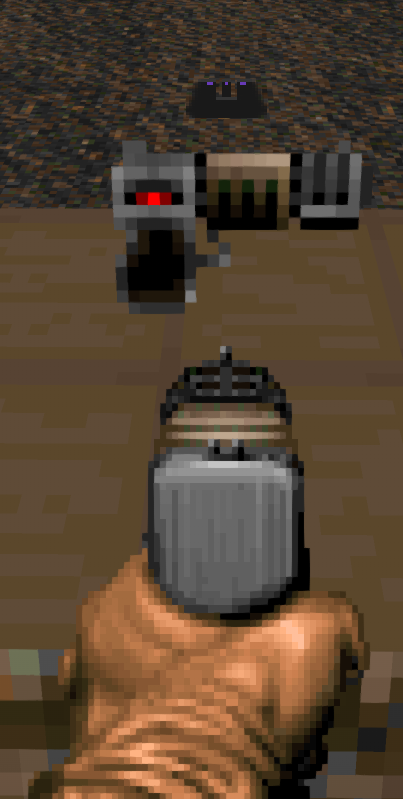  
_Credits: [UNKNOWN](#UNKNOWN-CREDITS)_

#### Obrozz Pistol
_Requires [Radtech Weapons Pack](https://github.com/swampyrad/RadTechWeaponsPack)_

The Obrozz Pistol's scope lens has been recolored to differentiate it from the base Boss as well as match thematically.

  
_Credits: Swampyrad_

#### Greely
_Requires [Peppergrinder](https://gitlab.com/hdiscord-saltmines/hd-peppergrinder)_

The Greely's main body has been recolored ~~so Player 2 can have a turn~~ to match thematically.

  
_Credits:  
HUD Sprites: AdianoTMO69, PrettyFist  
Pickup Sprites: PrettyFist_

#### Combat Shotgun
_Requires [Radtech Weapons Pack](https://github.com/swampyrad/RadTechWeaponsPack)_

The Combat Shotgun has been swapped out with the Duke3D Shotgun, which as then had its ironsights recolored to match the reticle colors.

  
_Credits: JoeyTD, Minigunner ([Realm667](https://www.realm667.com/en/armory-mainmenu-157-97317/doom-style-mainmenu-158-94349/841-duke-shotgun))_

#### TRO-G AR
_Requires [Peppergrinder](https://gitlab.com/hdiscord-saltmines/hd-peppergrinder)_

The TRO-G has been swapped out with the original version from Chopblock, recolored to a nice atomic purple to match thematically.

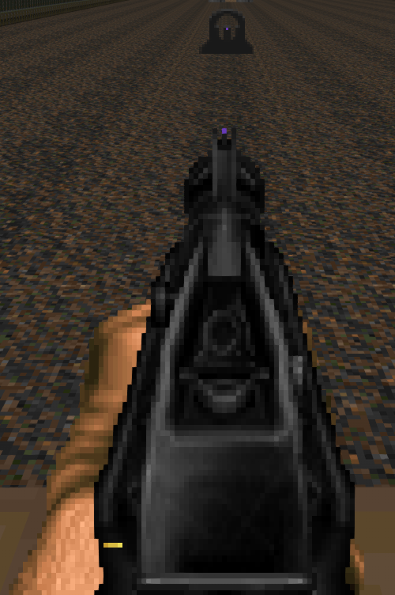  
_Credits: Chopblock223, ID Software, 3D Realms_

#### Vera
_Requires [Peppergrinder](https://gitlab.com/hdiscord-saltmines/hd-peppergrinder)_

The Vera has had its Ironsight dots recolored to match its reticle sprites, as well as have its ammo box & stock recolored to match thematically.

  
_Credits: Ultra64_

#### BreakerTek P90
_Requires [Peppergrinder](https://gitlab.com/hdiscord-saltmines/hd-peppergrinder)_

The P90 has had its sight dot recolored to match the reticle color.

  
_Credits: Prettyfist_

#### Bastard Rifle
_Requires [Peppergrinder](https://gitlab.com/hdiscord-saltmines/hd-peppergrinder)_

The Bastard Rifle has been replaced with this totally rad "Atomic Purple" skin straight out of the 90s!.

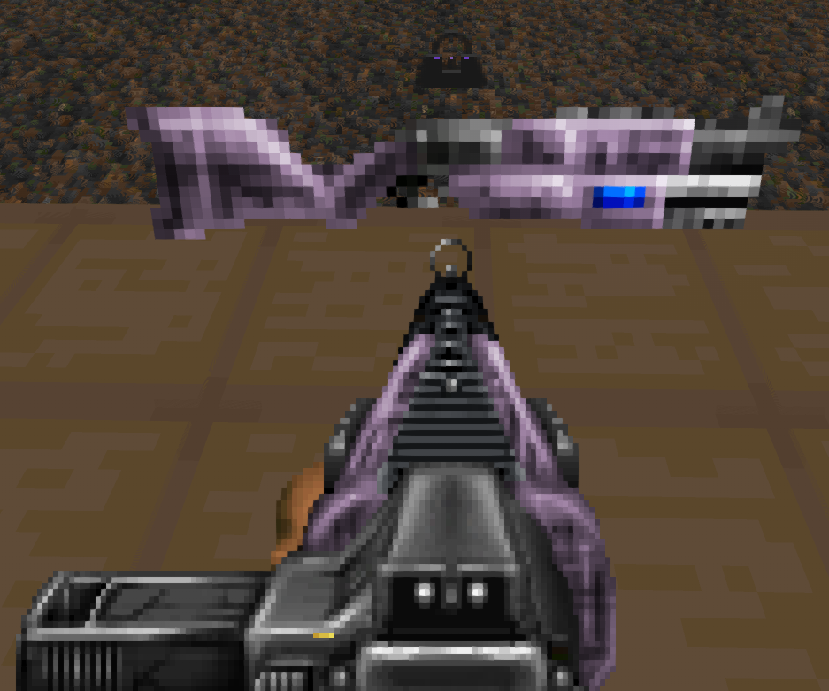  
_Credits: Skelegant, Combine_Kegan_

#### ZM94 "Sniperwolf" Anti-Materiel Rifle
_Requires [Peppergrinder](https://gitlab.com/hdiscord-saltmines/hd-peppergrinder)_

The ZM94 has been swapped out with the [ZM69](https://forum.zdoom.org/viewtopic.php?f=43&t=66091) Sniper Rifle sprites, as well as have its scope lens recolored to match thematically.

  
_Credits: Tartlman, Matt_

#### Iron Sights Boss Rifle
_Requires [Hexadoken's Legacy Continued](https://github.com/HDest-Community/HexaDoken-Legacy-Continued)_

The Scopeless Boss Rifle has had its Ironsight dots recolored to match the reticle sight sprites.

  
_Credits: HexaDoken_

#### PD-42
_Requires [Icarus Innovations Improved](https://github.com/HDest-Community/icarus-innovations-improved)_

The PD-42's body has been recolored to give better visual contrast between it and the player's gloves, as well match thematically.  The Ironsight dot has also been updated to match the crosshair color.

  
_Credits: Icarus, Railgunner_

#### Six-12 Shotgun
_Requires [Icarus Innovations Improved](https://github.com/HDest-Community/icarus-innovations-improved)_

The Six12 Shotgun has been replaced with one made by Sonik.O.

  
_Credits: Sonik.O_

#### USP-45
_Requires [Icarus Innovations Improved](https://github.com/HDest-Community/icarus-innovations-improved)_

The USP-45 has been replaced with Project Brutality's own .45 ACP Pistol, with a more fitting pickup sprite and recolored to match thematically.

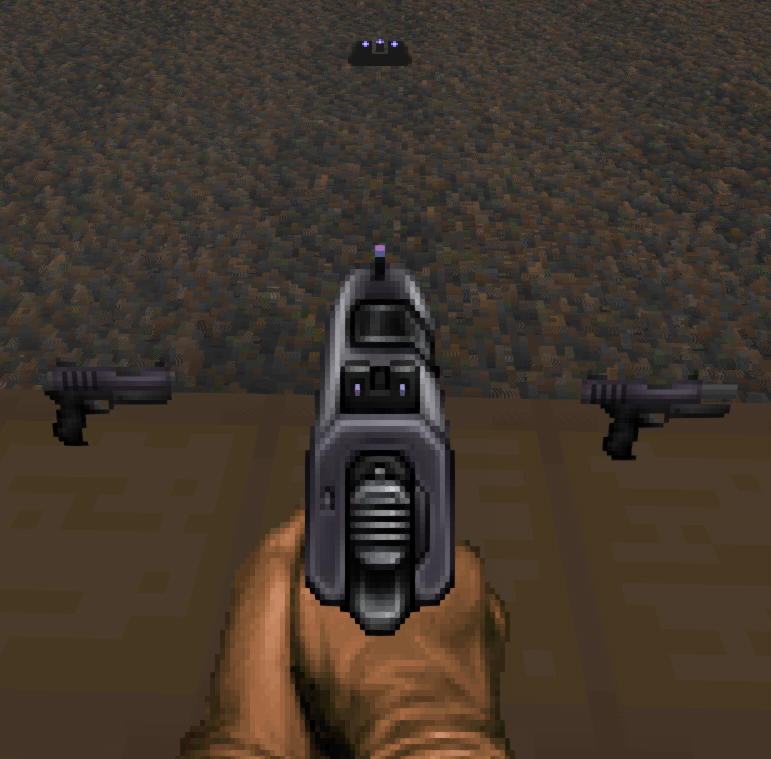
_Credits:  
HUD Sprites: DoomNukem, Sergeant Mark IV, Moa Dixon  
Pickup Sprites: Carbine Dioxide_

#### UMS Automag
_Requires [UMS Automag](https://dastrukar.gitlab.io/hddons-list/#weapons:umsautomag-zikshadow)_

The UMS Automag has been replaced with something that also visually has the mag in front of the player's hand, but also fits a bit more cohesively, visually speaking.

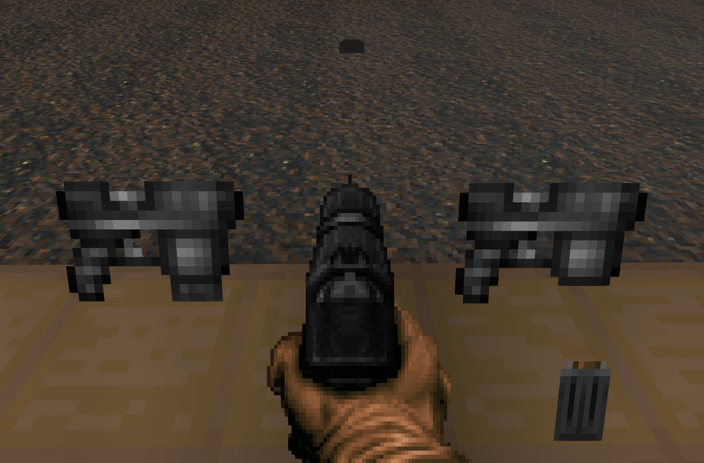  
_Credits:  
HUD Sprites: Tapor, Sonik.O  
Pickup Sprites: TommyGalano5, Sonik.O_

### Item Sprite Changes

#### Keys

The keys have all had their pickup sprites replaced with a set that gives them both variety as well as a fresh new look!

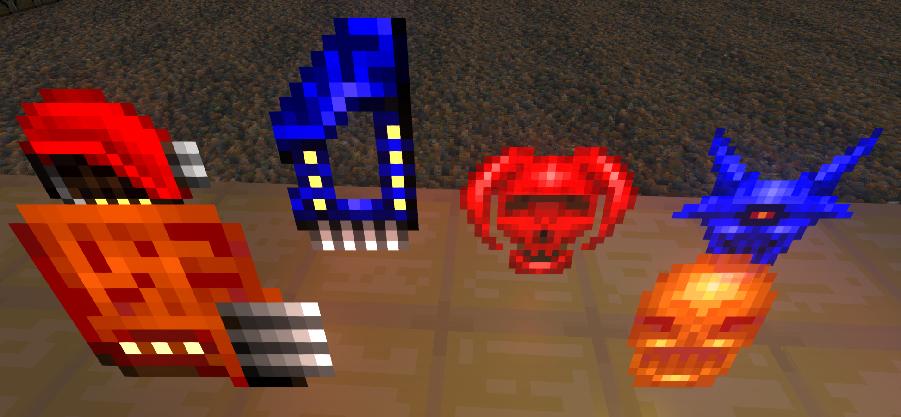  
_Credits: Sonik.O_  

#### Automap

The Automap has been replaced with a fresh new look!

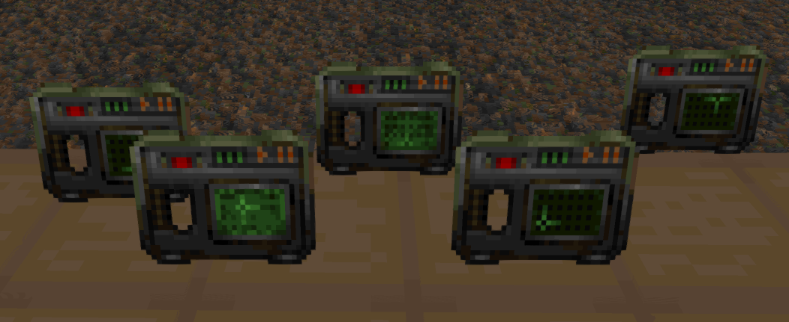  
_Credits: Sonik.O_

#### Light-amp Goggles

The Light-amp Goggles have been replaced to feel more tactical

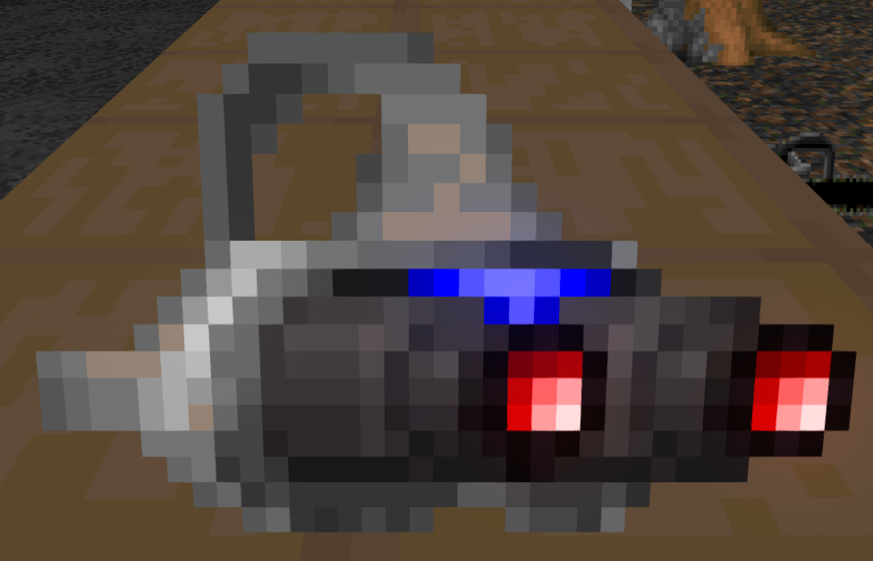  
_Credits: osjclatchford_

#### Environmental Shielding Suit

The Environment Suit has been replaced with one that includes a full-body containment, rather than simply looking like a cleanup garment.

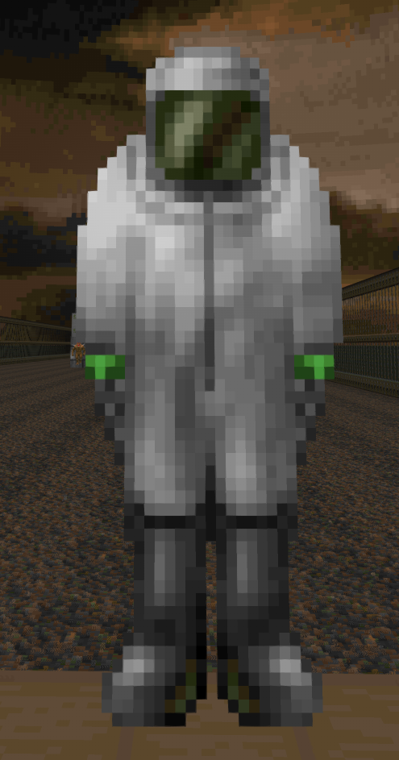  
_Credits: Sonik.O_

#### Shield Core

The Shield Core Pickup Sprite has been replaced with one that fits the Space Marine aesthetic while still maintaining the ancient rusty look.

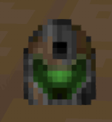  
_Credits: Sonik.O_

#### Squad Summoner

By way of the other replacements, the Squad Summoner has thus also been updated.

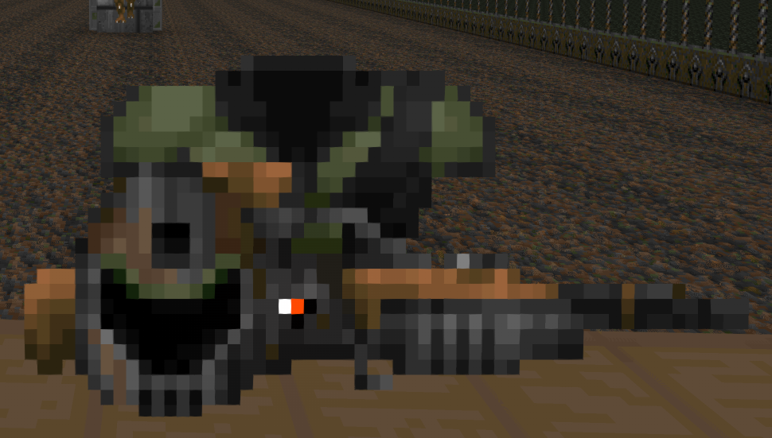  
_Credits:_  
_Garrison Armor ([DRLA Credits](#DRLA-Credits)): SoloSpaghetti ([DRLA](https://forum.zdoom.org/viewtopic.php?t=37044))_  
_Liberator: Matt & Combine Kegan_  
_Shield Core: Sonik.O_  
_Dogtags: TedTheDragon_

#### HUD Helmet
_Requires [Hideous Helmet](https://forum.zdoom.org/viewtopic.php?f=43&t=71950)_

The HUD Helmet has been replaced to match the mugshots provided by HUD Helmet.

  
_Credits: Mephresfire_

#### Micro-Cell
_Requires [Radtech Weapons Pack](https://github.com/swampyrad/RadTechWeaponsPack)_

The Micro-cell has been replaced to feel more like a conventional cylindrical battery

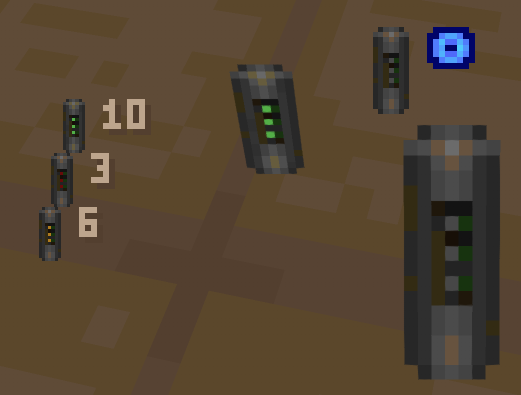  
_Credits: osjclatchford_

#### Garrison Armor
The Garrison Armor has been replaced to give it a more "all-purpose" feel.

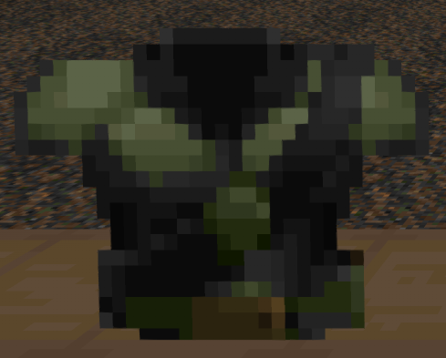  
_[DRLA Credits](#DRLA-Credits): SoloSpaghetti ([DRLA](https://forum.zdoom.org/viewtopic.php?t=37044))_

#### Leather Jacket
_Requires [Radtech Items Pack](https://github.com/swampyrad/RadTechItemPack)_

The Leather Jacket has been replaced to feel more "Space Cowboy".

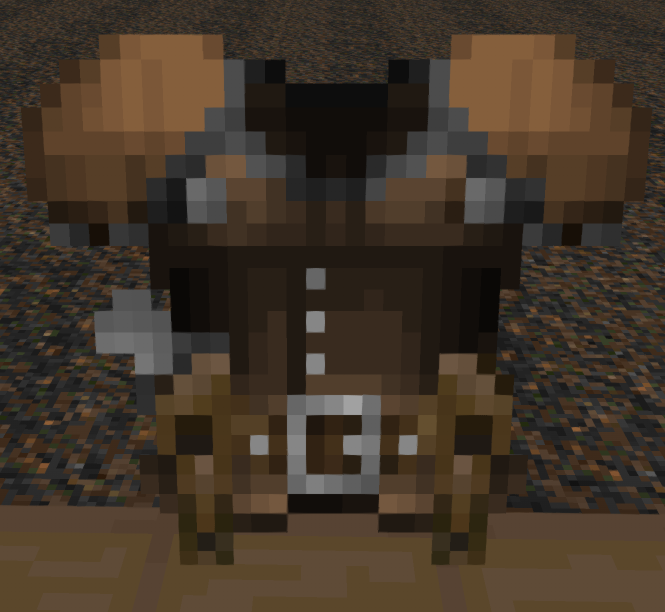  
_[DRLA Credits](#DRLA-Credits): SoloSpaghetti ([DRLA](https://forum.zdoom.org/viewtopic.php?t=37044))_

#### Sneaking Suit
_Requires [Sneaking Suit](https://codeberg.org/Wanzer/HDst_WAN_SneakingSuit)_

The Sneaking Suit has been replaced to fit the dimensions of the rest of the armors while also giving it a more lightweight/tactical feel.

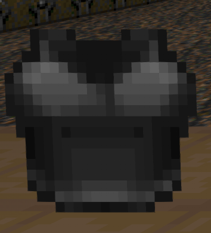  
_[DRLA Credits](#DRLA-Credits): SoloSpaghetti ([DRLA](https://forum.zdoom.org/viewtopic.php?t=37044))_

#### UAC Corporate Armor
_Requires [UAC Corporate Armor](https://codeberg.org/TwelveEyes/hd_uacarmour/)_

The UAC Corporate Armor has been replaced to give it a more "tech-armor" feel.

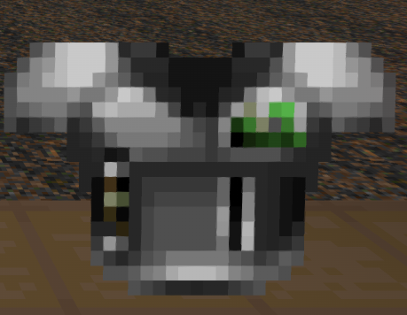  
_Credits: Ghastly Dragon ([Pandemonia](https://forum.zdoom.org/viewtopic.php?t=60984) )_

#### HEV Armor
_Requires [HEV Armor](https://gitlab.com/icarus-innovations/hdest-addons/hev-armor)_

The HEV Armor has been replaced to make it less of a simple recolor.

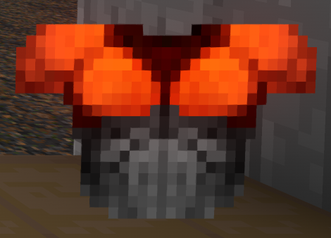  
_Credits: Lightsource ([Pandemonia](https://forum.zdoom.org/viewtopic.php?t=60984) )_

#### Field Assembly Kit
_Requires [Cozi's Offworld Wares](https://github.com/Deadondev/Cozis-Offworld-Wares)_

The Field Assembly Kit crate has been replaced to preserve the UAC logo, rather than Ace's personal logo.

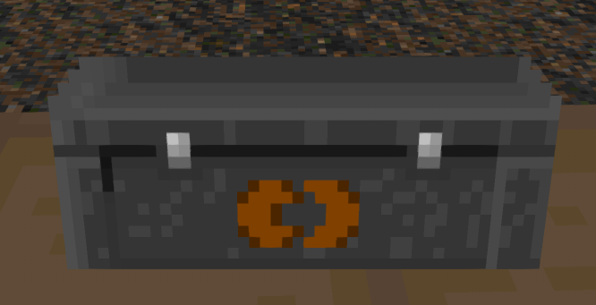  
_Credits: Yholl, id Software_

#### Medical Bag
_Requires [Cozi's Offworld Wares](https://github.com/Deadondev/Cozis-Offworld-Wares)_

The Medical Bag always felt off to be carrying multiple "full-size" backpacks alongside the main backpack.  Instead, it has been swapped out with one that more closely resembles the Ammo Pouch.

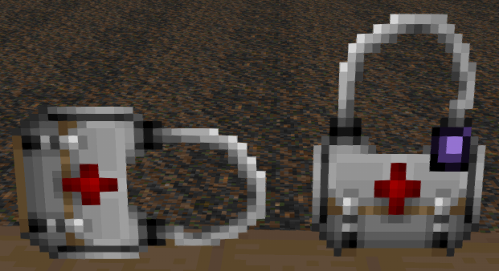  
_Credits: Zrrion_

#### Logistics Bag
_Requires [Cozi's Offworld Wares](https://github.com/Deadondev/Cozis-Offworld-Wares)_

The Logistics Bag also always felt off to be carrying multiple "full-size" backpacks alongside the main backpack.  Instead, it has been swapped out with the original "Gunsmith Pouch" from the mod of the same name, so that it more closely resembles the Ammo Pouch.

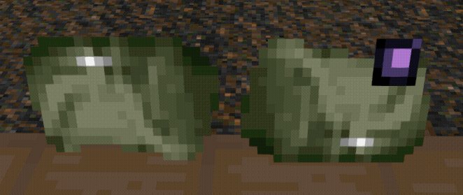  
_Credits: Skelegant ([Gunsmith Pouch](https://dastrukar.gitlab.io/hddons-list/#utilities:gunsmithpouch-mohl))_  

#### Merchant's Mercenary Bucks  

The Mercenary Bucks icon has been swapped out with an actual dollar bill from Duke Nukem 3D.  
_Credits: 3D Realms_  

---
### Other Changes

#### Font Changes
- BIGFONT has been replaced with Jimmy's StatusReport BigFont, which takes inspiration from ID Software's statusbar font.
- SMALLFNT has been replaced with Jimmy's StatusReport Font, which takes inspiration from ID Software's statusbar font.

#### HUD Helmet Backgrounds
_Requires [Hideous Helmet Extended](https://github.com/UndeadZeratul/hideous-helmet-extended)_

The various Preset HUD Backgrounds have all been recolored to match thematically.

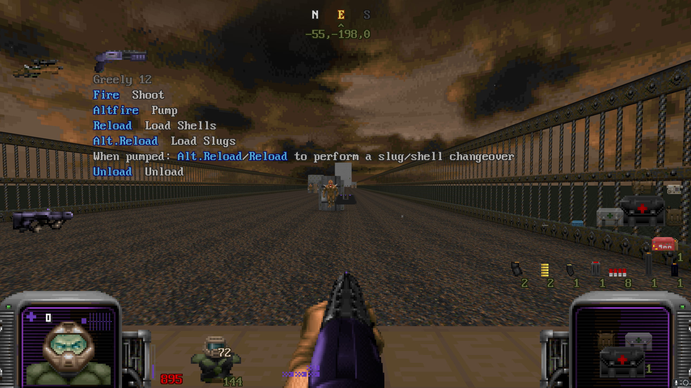  
_Credits: TommyGalano5, id Software, Sgt. Kiwi, Arcterezion_  

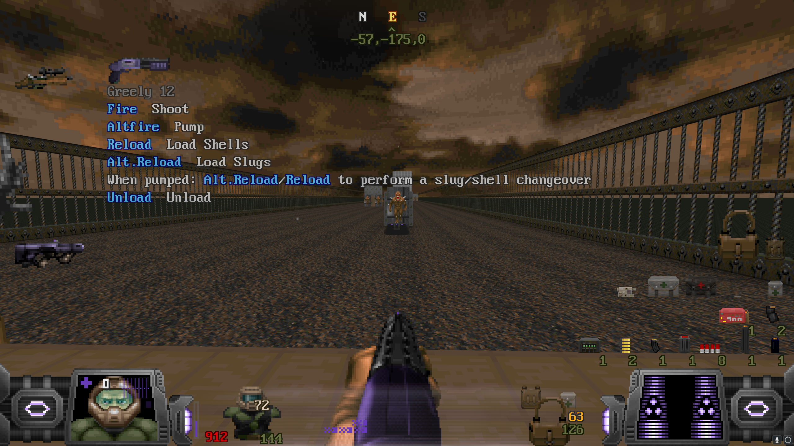  
_Credits: Arcterezion_  

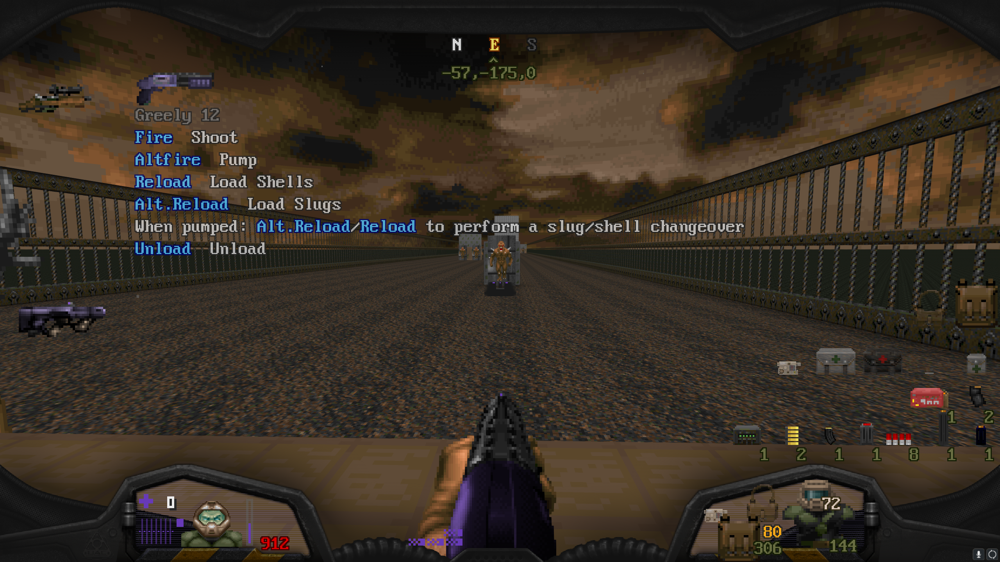  
_Credits: Saegiru, WildWeasel, 2800fps, DoomNukem_  

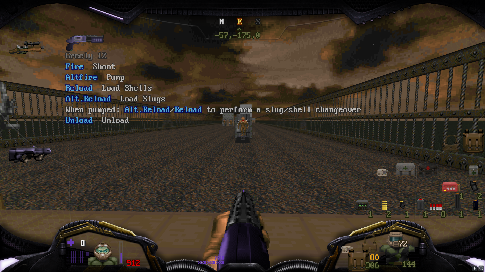  
_Credits: Saegiru, WildWeasel, 2800fps, Lightsource, DoomNukem_  

---
## Special Thanks

- Matt, for creating Hideous Destructor itself
- Dizzy, for giving me the inspiration to make my own HDest Addon
- All of those who created the assets used in this pack.
	- Image credits have been listed under their respective screenshots

### DRLA Credits
_Assets used from [DRLA](https://forum.zdoom.org/viewtopic.php?t=37044) have been done so with permission.  
**PERMISSION FROM DRLA AUTHORS IS REQUIRED TO RE-USE THEM**_

- **SoloSpaghetti**, for the Bulletproof Vest sprite (Sneaking Suit), the Tactical Armor sprite (Garrison Armor), and the Western Armor sprite (Leather Jacket)  

### UNKNOWN CREDITS
_I've tried finding the original owner for these assets and have come up empty.  
If you are or know the owner, please let me know to correct them._

- Various Hands sprites, including the unarmed Fist sprites, came from the [Master Hand Sheet](https://imgur.com/FIYBDSI), and thus I'm not sure who did these specific alternative punching sprites.
- The Plasma Pistol HUD & pickup sprites (Phazer).  These were taken from DRLA, but I have been informed they were not made for DRLA and the original ownership has been lost.
