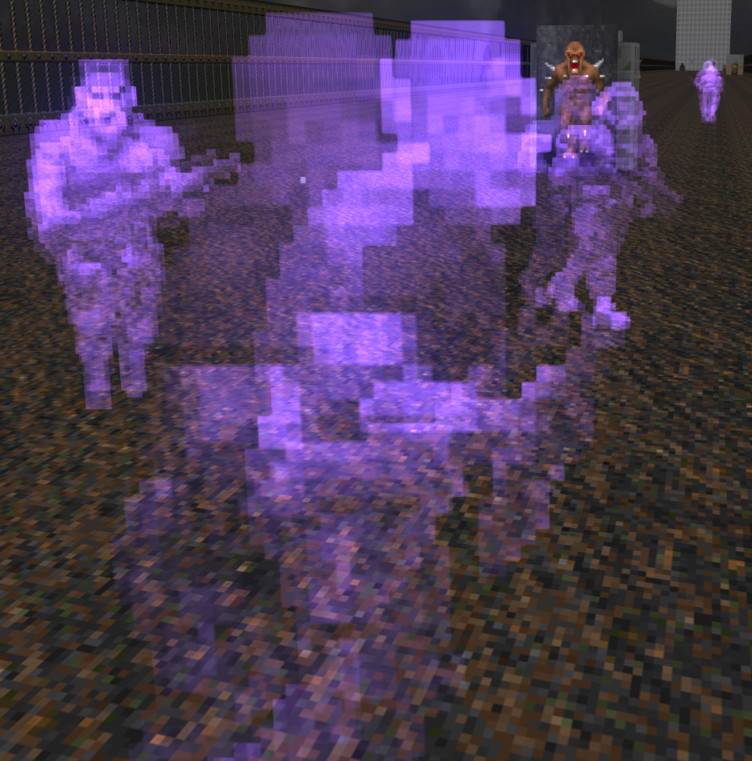
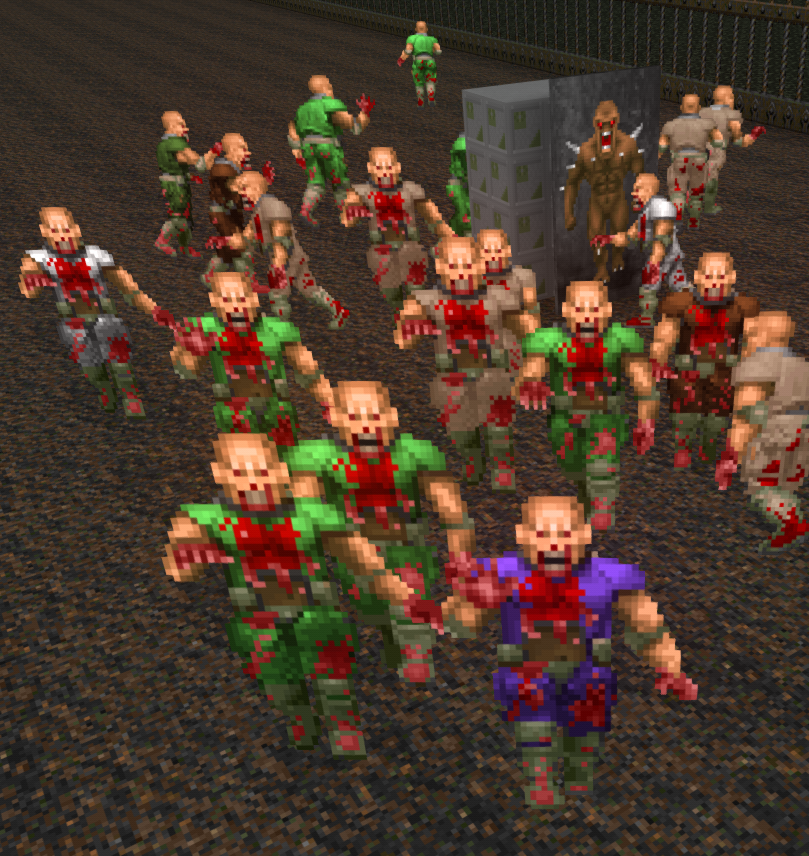
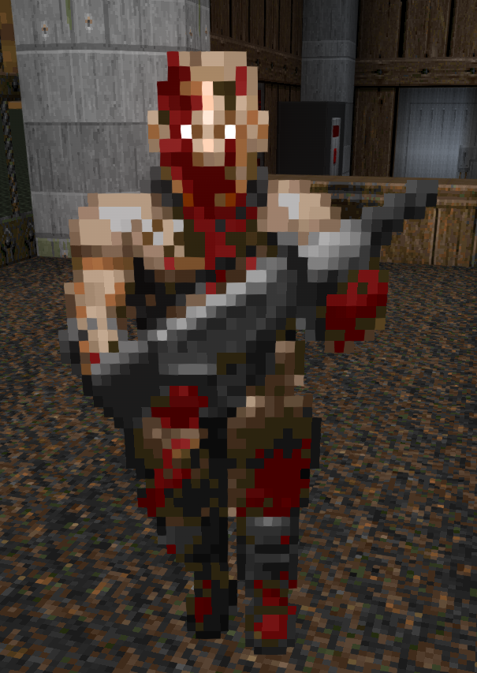
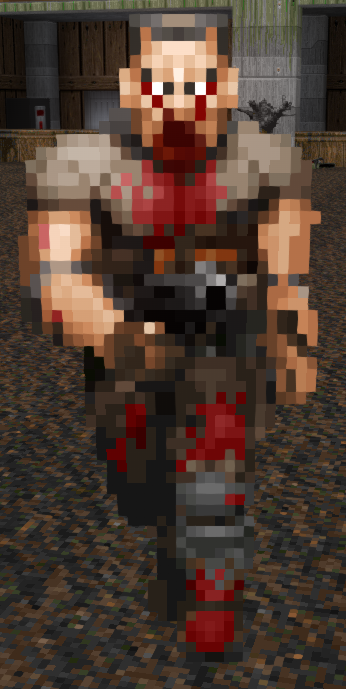
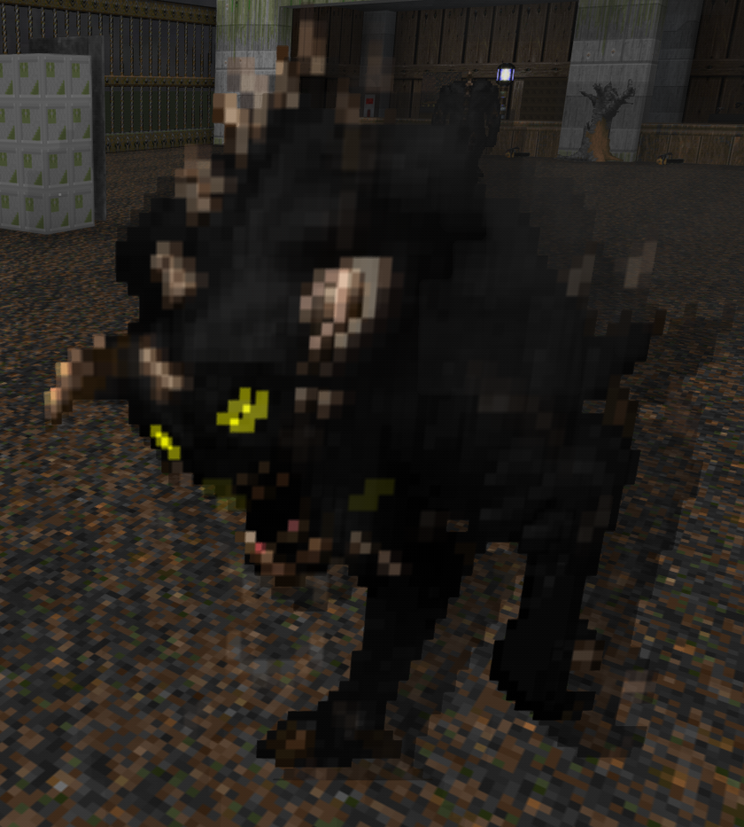
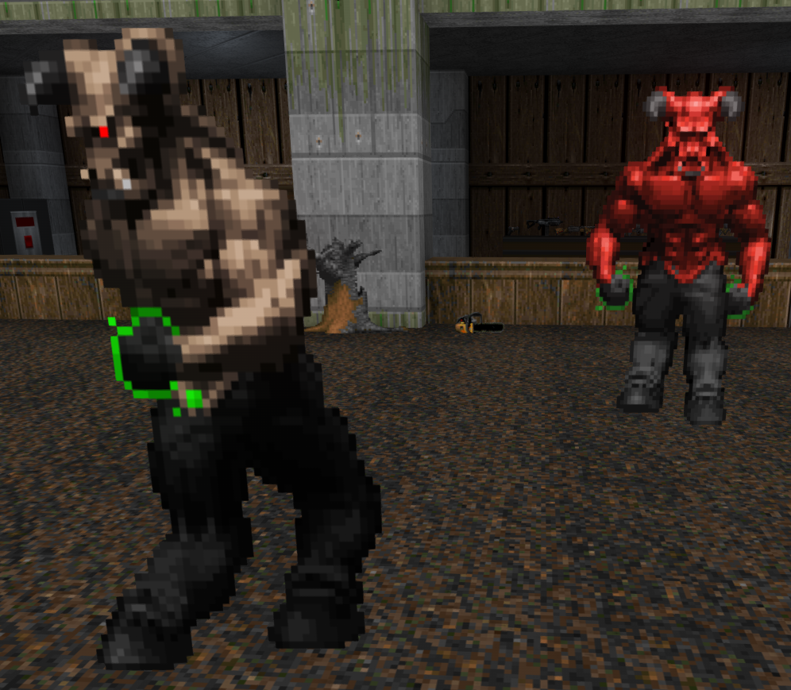

# id Doom Changes

When playing id Doom, the following changes occur:

### Monster Sprite Changes

#### Ghost Squadron

The ghost squadron translation has been updated to match the rest of the reskin thematically.

#### Zombiemen

##### Melee Zombies
_Requires [Radtech Zombies](https://github.com/swampyrad/RadTechZombies)_

The melee zombie has been replaced with a more "fitting" id Doom Zombieman, with matching translations.

  
_Credits: ShallowB, Solmyr, Metal\_Spaghetti, OSJClatchford_

Numerous zombiemen variants have been replaced with recolored versions, altered versions, or even new sprites entirely; to give them a darker, spookier appearance, or even just more visual consistency.

##### ZM-66 Zombieman

The ZM-66 Zombieman has been replaced with a recolored version to give them a darker, spookier appearance.

  
_Credits: Project Malice Team, id Software_

##### ZM-66 Jackboot
_Requires [Melodica's Visual Zombies](https://dastrukar.gitlab.io/hddons-list/#visualzombies-melodica)_

The ZM-66 Jackboot has been replaced with a recolored version to give them a darker, spookier appearance.

  
_Credits: Project Malice Team, id Software_

##### Pistol Zombieman
_Requires [HDest Re-Enforcements](https://github.com/FDAapproved/HDest-Re-Enforcements)_

The Pistol Zombieman has been replaced with a UAC Office employee, tweaked a bit to match the spooky vibes of the rest of the zombie variants.

  
_Credits: Solmyr, Scalliano, Ghostbusters Doom Team, id Software_

##### 10mm Pistol Zombieman
_Requires [Radtech Zombies](https://github.com/swampyrad/RadTechZombies)_

The 10mm Pistol Zombieman has been replaced with a recolored version to give them a darker, spookier appearance.

  
_Credits: Project Malice Team, id Software_

##### Sig-Cow Zombieman
_Requires [Radtech Zombies](https://github.com/swampyrad/RadTechZombies)_

The Sig-cow Zombieman has been replaced with a recolored version to give them a darker, spookier appearance.

  
_Credits: Project Malice Team, Skelegant, David G., id Software_

<!-- ##### Hunter Shotgun Zombieman

The Hunter Shotgun Zombieman has been replaced with a recolored version to give them a darker, spookier appearance.

  
_Credits: Project Malice Team, id Software_ -->

##### Greely Zombieman
_Requires [HDest Misc. Mons](https://github.com/tedthepraimortis/Hideous-MiscMons)_

The Greely Zombieman has been replaced with a recolored version to give them a darker, spookier appearance.

  
_Credits: Project Malice Team, Mark Quinn, Vegeta, Ghastly\_Dragon, MagicWazard, id Software_

##### MAC-10 Zombieman
_Requires [Caesar Salad](https://github.com/HDest-Community/PB_HDAddon_CaesarSalad)_

The MAC-10 Zombieman has been replaced with a recolored version to give them a darker, spookier appearance.

  
_Credits: Project Malice Team, id Software_

##### PD-42 Zombieman
_Requires [HDest Misc. Mons](https://github.com/tedthepraimortis/Hideous-MiscMons)_

The PD-42 Zombieman has been replaced with a recolored version to give them a darker, spookier appearance.

  
_Credits: Project Malice Team, Mark Quinn, Vegeta, Ghastly\_Dragon, MagicWazard, id Software_

##### Wolfenstein SS Zombieman

The Wolfenstein SS Zombieman has been replaced with a recolored version to give them a darker, spookier appearance.

  
_Credits: Project Malice Team, id Software_

#### Imp Variants
_Requires [Melodica's Visual Zombies](https://dastrukar.gitlab.io/hddons-list/#visualzombies-melodica)_  
_NOTE: If Visual Zombies is not loaded, the Fighter Imp will be used for all three to varying degree of success_  

The three main imp variants (Fighter, Mage, and Healer) now have more distinct appearances.  

  
_Credits:_  
_Fighter Imp: Project Malice Team, H3llW4lk3r (from Project Malice)_  
_Mage Imp: Project Malice Team, IMX_  
_Credits: Supercharge Team, IMX_

#### Ninja Pirate

The ninja pirate has been replaced with a recolored version of Hell-Forged's Brute, to match the anomalous nature of this beast's ability to phase in and out of visible perception.

  
_Credits: Project Malice Team, Eriance/Amuscaria_

#### Mancubus

The mancubus has been replaced with a recolored version to give them a darker, spookier appearance.

  
_Credits: Project Malice Team, Daedalus, id Software_

#### Hell Nobles

The hell knight & baron of hell have been replaced with recolored versions to give them a darker, spookier appearance.

  
_Credits:_  
_Hell Knight: Project Malice Team, id Software_  
_Baron of Hell: Supercharge Team, Gifty & Vdude, Skulltag Team, id Software_

#### Hell Squire
_Requires [HDest Re-Enforcements](https://github.com/FDAapproved/HDest-Re-Enforcements)_

The hell squire has been replaced with one that fits with the above reskins for the vanilla nobles, giving it a darker and more spooky appearance.

  
_Credits: Project Malice Team, DBThanatos, Zaneion, id Software_

#### Arachnotron

The arachnotron has been replaced with one that gives more of a dark and hellish appearance.

  
_Credits: Project Malice Team, Amuscaria/Eriance_

#### Lost Soul

The Lost Soul has been replaced with one that gives it more of a ghostly, spookier appearance.

  
_Credits: DerTimmy_

#### Ghoul
_Requires [HDest Critters](https://github.com/HDest-Community/HDest-Critters)_

The Ghoul has been replaced with one that fits better than the Alpha Lost Soul, now that the Lost Soul has also been replaced.  This also fits more along the lines of it being a mini-caco, similar to the Hatchling it's a carbon-copy of.

  
_Credits: Burgish\_Nilwert_

#### Cacodemon

The cacodemon's death animation has been replaced with one that feels much more electrifying, given their proclivity to emit sparks when dead.

  
_Credits: Robo\_Cola, id Software_

#### Spider Mastermind

The spider mastermind has been replaced with one that gives more of a consistent, yet dark and hellish appearance.

  
_Credits: Project Malice Team, Amuscaria/Eriance_

#### Flemoids
_Requires [HDFlemoids](https://codeberg.org/ExpiredPopsicle/HDFlemoids)_

Replaces the Chex Quest Flemoid sprites with a more fitting "id Doom" flavored Slime Monster.

  
_Credits: Carbine Dioxide_