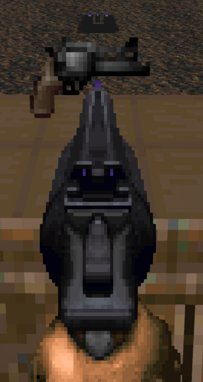
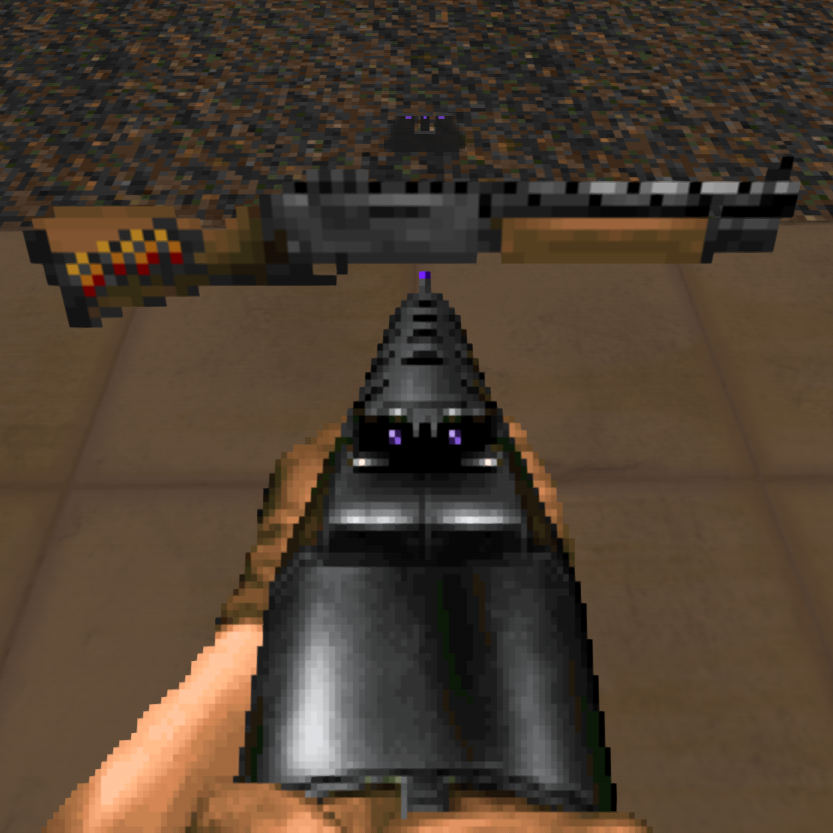
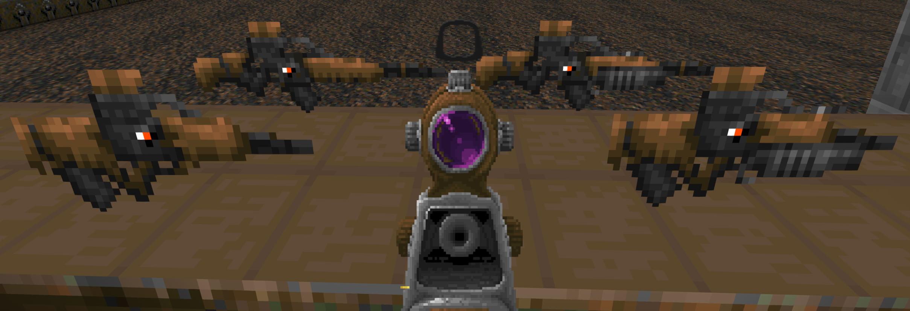
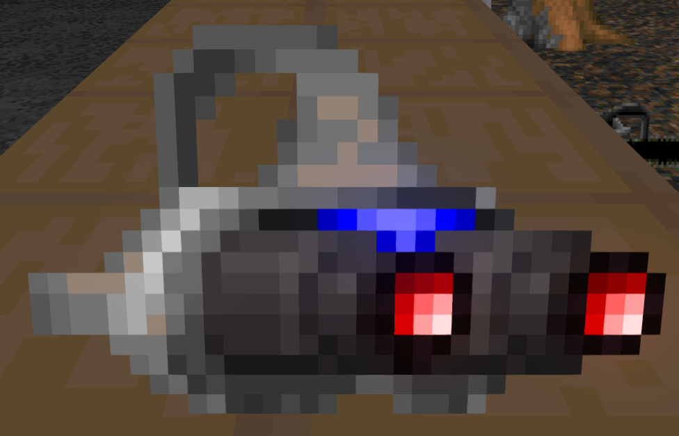
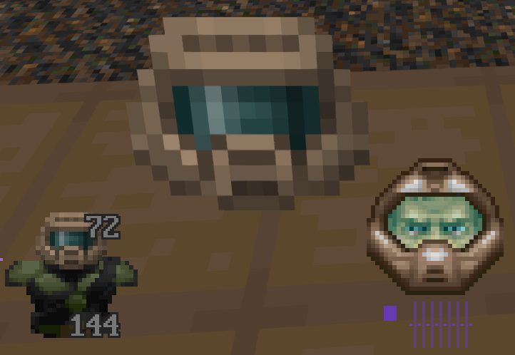
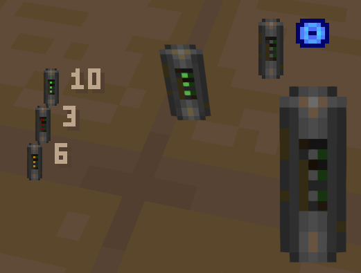
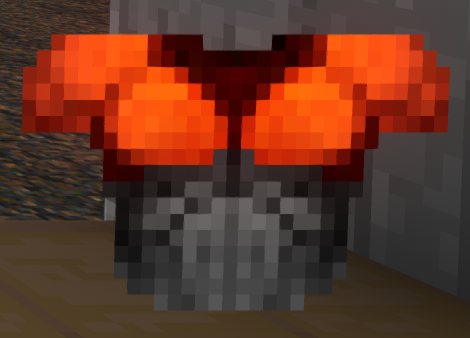

# UZ's Hideous Destructor Addon

This is my personal collection of recolor/resprite/resound assets for the GZDoom gameplay mod, "Hideous Destructor".  As it's my personal collection of changes, there are several various mods it makes changes to.

---
## Sprite Changes

### Recolored Ironsights

#### Vanilla Hideous Destructor
- Default Hideous Destructor Front & Back Ironsights

#### Peppergrinder
- HLAR 9mm AR Front Ironsight
- BPX 9mm Carbine Rifle Back Ironsight
- Sig-Cow 10mm Carbine Rifle Back Ironsight
- TRO-G AR Front Ironsight

### Weapon Sprite Changes
_Note: Some weapons included have the crosshair color "baked" into the sprite, and for those weapons I have taken the liberty of tweaking the in-game sprite to match my personal crosshair color.  If you would like your crosshair color to match, simply update the color in the main GZDoom options menu to `#673ab7`_

#### Pistols
_Requires [Radtech Weapons Pack](https://github.com/swampyrad/RadTechWeaponsPack)_

The pistol has been swapped out with Glock18 sprites, then recolored to match thematically.  The "Quick Swap" set of sprites have the pistol correctly flipped, as well.

  

#### Revolvers
_Scoped Revolver requires [Peppergrinder](https://gitlab.com/hdiscord-saltmines/hd-peppergrinder)_

The Revolver's main body and Ironsights have been recolored, which also applies to the Peppergrinder Scoped Revolver.

 

#### Arkoudi Revolver Shotgun
_Arkoudi Revolver Shotgun requires [Potetobloke's Weapon Pack](https://cdn.discordapp.com/attachments/713246305392001055/1017590614365323295/PB-Mohl_HDAddon_WeaponPack_4.8.2a_RC2a.pk3)_

The Arkoudi Revolver Shotgun's ironsights have been recolored.

#### Hunter Shotgun
The hunter has been swapped out with Complex Doom's Shotgun sprites, then recolored to match thematically.

#### ZM-66 Assault Rifle
The ZM-66 has been swapped out with an older version of its HUD & pickup sprites, then had its scope lens recolored to match thematically.

#### Liberator Battle Rifle
The Liberator has been swapped out with an older version of its HUD & pickup sprites, then had its scope lens recolored to match thematically.

#### Blooper Grenade Launcher
The Blooper has been swapped out for a Break-Action Grenade Launcher by Sonik.O.

#### Brontornis
The Brontornis' Ironsight dot has been updated to match the default Front Sight sprite.

#### 10mm Pistol
_Requires [Radtech Weapons Pack](https://github.com/swampyrad/RadTechWeaponsPack)_

The 10mm Pistol's rear Ironsight dots have been recolored to match the default Sight sprites.

#### Phazer
_Requires [Radtech Weapons Pack](https://github.com/swampyrad/RadTechWeaponsPack)_

The Phazer has been swapped out with a more fitting D-93 Plasma Pistol.

#### Obrozz Pistol
_Requires [Radtech Weapons Pack](https://github.com/swampyrad/RadTechWeaponsPack)_

The Obrozz Pistol's scope lens has been recolored to differentiate it from the base Boss as well as match thematically.

#### Greely
_Requires [Peppergrinder](https://gitlab.com/hdiscord-saltmines/hd-peppergrinder)_

The Greely's main body has been recolored ~~so Player 2 can have a turn~~ to match thematically.

#### Sawed-Off Slayer
_Requires [Peppergrinder](https://gitlab.com/hdiscord-saltmines/hd-peppergrinder)_

The Sawed-Off Slayer has been given a set of sprites to help it feel more hand-held.

#### Combat Shotgun
_Requires [Radtech Weapons Pack](https://github.com/swampyrad/RadTechWeaponsPack)_

The Combat Shotgun has been swapped out with the Duke3D Shotgun, which as then had its ironsights recolored to match the reticle colors.

#### TRO-G AR
_Requires [Peppergrinder](https://gitlab.com/hdiscord-saltmines/hd-peppergrinder)_

The TRO-G has had its front ironsight modified to match thematically.

#### Vera 
_Requires [Peppergrinder](https://gitlab.com/hdiscord-saltmines/hd-peppergrinder)_

The Vera has had its Ironsight dots recolored to match its reticle sprites, as well as have its ammo box & stock recolored to match thematically.

#### BreakerTek P90 
_Requires [Peppergrinder](https://gitlab.com/hdiscord-saltmines/hd-peppergrinder)_

The P90 has had its sight dot recolored to match the reticle color.

#### ZM94 "Sniperwolf" Anti-Material Rifle
_Requires [Peppergrinder](https://gitlab.com/hdiscord-saltmines/hd-peppergrinder)_

The ZM94 has been swapped out with the [ZM69]() Sniper Rifle sprites, as well as have its scope lens recolored to match thematically.

#### Scopeless Boss Rifle 
_Requires [Hexadoken's Legacy Continued](https://github.com/Gay-Snake-Squad/HexaDoken-Legacy-Continued)_

The Scopeless Boss Rifle has had its Ironsight dots recolored to match the reticle sight sprites.

#### Six-12 Shotgun
_Requires [Six12](https://gitlab.com/icarus-innovations/hdest-addons/six12)_

The Six12 Shotgun's body & Ironsight sprites have been recolored to match thematically.

#### PD-42
_Requires [PD42](https://gitlab.com/icarus-innovations/hdest-addons/pd-42)_

The PD-42's body has been recolored to give better visual contrast between it and the player's gloves, as well match thematically.  The Ironsight dot has also been updated to match the crosshair color.

### Item Sprite Changes

#### Light-amp Goggles

The Light-amp Goggles have been replaced to feel more tactical

#### HUD Helmet
_Requires [Hideous Helmet](https://forum.zdoom.org/viewtopic.php?f=43&t=71950)_

The HUD Helmet has been replaced to match the mugshots provided by HUD Helmet.

#### Micro-Cell
_Requires [Radtech Weapons Pack](https://github.com/swampyrad/RadTechWeaponsPack)_

The Micro-cell has been replaced to feel more like a conventional cylindrical battery

#### Garrison Armor
The Garrison Armor has been replaced to give it a more "all-purpose" feel.

#### Leather Jacket
_Requires [Radtech Items Pack](https://github.com/swampyrad/RadTechItemPack)_

The Leather Jacket has been replaced to feel more "Space Cowboy".

#### Sneaking Suit
_Requires [Sneaking Suit](https://codeberg.org/Wanzer/HDst_WAN_SneakingSuit)_

The Sneaking Suit has been replaced to fit the dimensions of the rest of the armors while also giving it a more lightweight/tactical feel.

#### UAC Corporate Armor
_Requires [UAC Corporate Armor](https://codeberg.org/TwelveEyes/hd_uacarmour/)_

The UAC Corporate Armor has been replaced to give it a more "tech-armor" feel.

#### HEV Armor
_Requires [HEV Armor](https://gitlab.com/icarus-innovations/hdest-addons/hev-armor)_

The HEV Armor has been replaced to make it less of a simple recolor.

#### Field Assembly Kit
_Requires [Cozi's Offworld Wares](https://github.com/Deadondev/Cozis-Offworld-Wares)_

The Field Assembly Kit crate has been replaced to preserve the UAC logo, rather than Ace's personal logo.

#### Medical Bag
_Requires [Cozi's Offworld Wares](https://github.com/Deadondev/Cozis-Offworld-Wares)_

The Medical Bag always felt off to be carrying multiple "full-size" backpacks alongside the main backpack.  Instead, it has been swapped out with one that more closely resembles the Ammo Pouch.

#### Logistics Bag
_Requires [Cozi's Offworld Wares](https://github.com/Deadondev/Cozis-Offworld-Wares)_

The Logistics Bag also always felt off to be carrying multiple "full-size" backpacks alongside the main backpack.  Instead, it has been swapped out with the original "Gunsmith Pouch" from the mod of the same name, so that it more closely resembles the Ammo Pouch.

---

### Other Changes

#### Cacodemon
When playing id Doom, the cacodemon's death animation has been replaced with one that feels much more electrifying, given their proclivity to emit sparks when dead.

---
## Credits

- Matt, for creating Hideous Destructor itself, including the Brontornis HUD sprites, the old ZM-66 & Liberator HUD & pickup sprites, as well as the default ironsight sprites
- Dizzy, for giving me the inspiration to make my own HDest Addon
- PrettyFist, for the Greely pickup sprite, as well as the P90 HUD & ironsight sprites, as well as the modified versions of Sonik.O's Scoped Revolver sprites
- AdianoTMO69, for the Shortened version of PrettyFist's Greely HUD sprites
- HexaDoken, for the Boss Variants' ironsight & HUD sprites
- Icarus, for modified versions of Sonik.O/Railgunner's Original Six12 sprites, as well as the PD-42's HUD sprites & Pickup sprites modified from various pickup sprites from Railgunner
- Swampyrad, for the Obrozz HUD sprites, as well as the Sig-Cow Ironsight sprites, as well as the Hush Puppy's Silencer sprites
- ChopBlock223, for the 10mm Pistol sprites based off of FreeDoom's Pistol sprites
- Ultra64, for the HLAR and Vera sprites
- Scuba Steve for the original Revolver sprites
- A1337Spy, for the BPX sprites
- A1337Spy, HyperUltra64, and Sledge for the modified versions of Chopblock's TRO-G sprites
- JoeyTD & Minigunner, for the [Realm667](https://www.realm667.com/en/armory-mainmenu-157-97317/doom-style-mainmenu-158-94349/996-glock-18) Glock18 Pistol Sprites (Quick Swap sprites flipped by me), as well as the [Realm667](https://www.realm667.com/en/armory-mainmenu-157-97317/doom-style-mainmenu-158-94349/841-duke-shotgun) Duke3D Shotgun sprites
- Daedalus, for the [Complex Doom](https://forum.zdoom.org/viewtopic.php?t=58535) Shotgun HUD sprites
- Neoworm, for the extended Shotgun HUD sprites
- ZikShadow, for the modified versions of Daedalus' original shotgun pickup sprites
- Tartlman (a.k.a. bogus), for the [ZM69](https://forum.zdoom.org/viewtopic.php?f=43&t=66091) pickup & HUD sprites based off of Hideous Destructor's ZM66 sprites
- Zrrion, for the Medical Pouch sprite
- id Software, CardboardMarty, JoeyTD, Neoworm, YukesVonFaust, Sonik.O, ChopBlock223; for the Sawed-Off Slayer HUD sprites
- Toast, for the modified version of Sonik.O's UAC Break-Action Grenade Launcher HUD & pickup sprites, as well as the Glock-18 pickup sprites (Pistol & Hush Puppy)
- Skelegant, for the [Gunsmith Pouch](https://dastrukar.gitlab.io/hddons-list/#utilities:gunsmithpouch-mohl) sprite
- Mephresfire, for the Hideous Helmet sprite
- Ghastly Dragon, for the [Pandemonia](https://forum.zdoom.org/viewtopic.php?t=60984) Tech Armor sprite (UAC Corporate Armor)
- Lightsource, for the [Pandemonia](https://forum.zdoom.org/viewtopic.php?t=60984) HD Armor sprite (HEV Armor)
- Yholl, for the modified version of ID Software's UAC Supply Crate sprite (Field Assembly Kit)
- LossForWords, for the Arkoudi Revolver Shotgun sprites
- Robo_Cola, for the alternative Cacodemon death sprites
- osjclatchford, for the microcell battery pickup sprite, as well as the Lightamp goggles pickup sprites

### DRLA Credits
_Assets used from [DRLA](https://forum.zdoom.org/viewtopic.php?t=37044) have been done so with permission.  
**PERMISSION FROM DRLA AUTHORS IS REQUIRED TO RE-USE THEM**_

- **SoloSpaghetti**, for the Bulletproof Vest sprite (Sneaking Suit), the Tactical Armor sprite (Garrison Armor), and the Western Armor sprite (Leather Jacket)

### UNKNOWN CREDITS
_I've tried finding the original owner for these assets and have come up empty.  
If you are or know the owner, please let me know to correct them._

- The Plasma Pistol HUD & pickup sprites (Phazer).  These were taken from DRLA, but I have been informed they were not made for DRLA and the original ownership has been lost.
