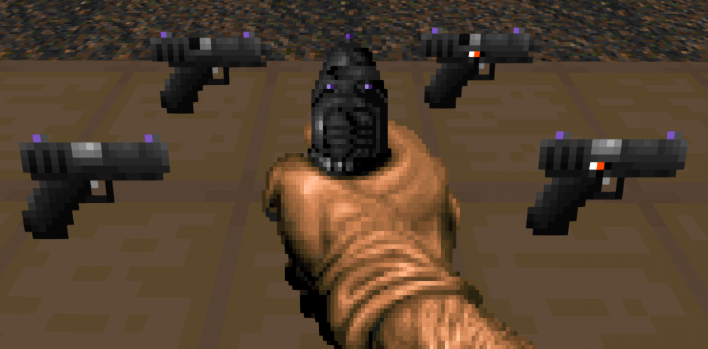
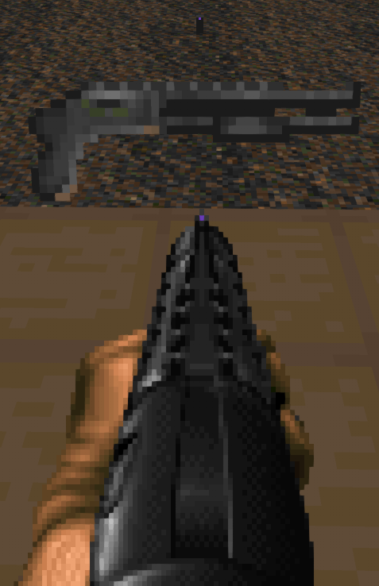

# UZ's Hideous Destructor Addon

This is my personal collection of recolor/resprite/resound assets for the GZDoom gameplay mod, "Hideous Destructor".  As it's my personal collection of changes, there are several various mods it makes changes to.

---
## Recolored Ironsights

### Vanilla Hideous Destructor
- Default Hideous Destructor Front & Back Ironsights

### Peppergrinder
- TRO-G AR Front Ironsight

---
## Weapon Sprite Changes
_Note: Some weapons included have the crosshair color "baked" into the sprite, and for those weapons I have taken the liberty of tweaking the in-game sprite to match my personal crosshair color.  If you would like your crosshair color to match, simply update the color in the main GZDoom options menu to `#673ab7`_

### Pistol
The pistol has been swapped out with Glock18 sprites, then recolored to match thematically.  The "Quick Swap" set of sprites have the pistol correctly flipped, as well.

### Revolver
_Scoped Revolver requires [Peppergrinder](https://gitlab.com/hdiscord-saltmines/hd-peppergrinder)_

The Revolver's main body and Ironsights have been recolored, which also applies to the Peppergrinder Scoped Revolver.

 

### Hunter Shotgun
The hunter has been swapped out for with Complex Doom's Shotgun sprites, then recolored to match thematically.

### Brontornis
The Brontornis' Ironsight dot has been updated to match the default Front Sight sprite.

### 10mm Pistol
_Requires [Radtech Weapons Pack](https://github.com/swampyrad/RadTechWeaponsPack)_

The 10mm Pistol's rear Ironsight dots have been recolored to match the default Sight sprites.

### Obrozz Pistol
_Requires [Radtech Weapons Pack](https://github.com/swampyrad/RadTechWeaponsPack)_

The Obrozz Pistol's scope lens has been recolored to differentiate it from the base Boss as well as match thematically.

### Greely
_Requires [Peppergrinder](https://gitlab.com/hdiscord-saltmines/hd-peppergrinder)_

The Greely's main body has been recolored ~~so Player 2 can have a turn~~ to match thematically.

### Combat Shotgun
_Requires [Radtech Weapons Pack](https://github.com/swampyrad/RadTechWeaponsPack)_

The Combat Shotgun has been swapped out with the Duke3D Shotgun, which as then had its ironsights recolored to match the reticle colors.

### Vera 
_Requires [Peppergrinder](https://gitlab.com/hdiscord-saltmines/hd-peppergrinder)_

The Vera has had its Ironsight dots recolored to match its reticle sprites, as well as have its ammo box & stock recolored to match thematically.

### BreakerTek P90 
_Requires [Peppergrinder](https://gitlab.com/hdiscord-saltmines/hd-peppergrinder)_

The P90 has had its sight dot recolored to match the reticle color.

### ZM94 "Sniperwolf" Anti-Material Rifle
_Requires [Peppergrinder](https://gitlab.com/hdiscord-saltmines/hd-peppergrinder)_

The ZM94 has been swapped out with the [ZM69]() Sniper Rifle sprites, as well as have its scope lens recolored to match thematically.

### Scopeless Boss Rifle 
_Requires [Hexadoken's Legacy Continued](https://github.com/Gay-Snake-Squad/HexaDoken-Legacy-Continued)_

The Scopeless Boss Rifle has had its Ironsight dots recolored to match the reticle sight sprites.

### Six-12 Shotgun
_Requires [Six12](https://gitlab.com/icarus-innovations/hdest-addons/six12)_

The Six12 Shotgun's body & Ironsight sprites have been recolored to match thematically.

### PD-42
_Requires [PD42](https://gitlab.com/icarus-innovations/hdest-addons/pd-42)_

The PD-42's body has been recolored to give better visual contrast between it and the player's gloves, as well match thematically.  The Ironsight dot has also been updated to match the crosshair color.

---
## Credits

- Matt, for creating Hideous Destructor itself, including the Brontornis HUD Sprites, as well as the default ironsight sprites
- Dizzy, for giving me the inspiration to make my own HDest Addon
- PrettyFist, for the Greely pickup & HUD sprites, as well as the P90 HUD & ironsight sprites, as well as the modified versions of Sonik.O's Scoped Revolver sprites
- AdianoTMO69, for the Shortened version of PrettyFist's Greely HUD sprites
- HexaDoken, for the Boss Variants' ironsight & HUD sprites
- Icarus, for modified versions of Sonik.O/Railgunner's Original Six12 sprites, as well as the PD-42's HUD sprites & Pickup sprites modified from various pickup sprites from Railgunner
- Swampyrad, for the Obrozz HUD sprites
- ChopBlock223, for the 10mm Pistol HUD sprites based off of FreeDoom's Pistol sprites
- Ultra64, for the Vera ironsight & HUD sprites
- Scuba Steve for the original Revolver sprites
- A1337Spy, for the TRO-G ironsight sprite
- JoeyTD & Minigunner, for the Glock18 Pistol Sprites (Quick Swap sprites flipped by me), as well as the Duke3D Shotgun sprites
- Daedalus, for the Shotgun HUD sprites
- ZikShadow, for the modified versions of Daedalus' original shotgun pickup sprites
- Tartlman (a.k.a. bogus), for the ZM69 pickup & HUD sprites based off of Hideous Destructor's ZM66 sprites
