# UZ's Hideous Destructor Addon
This is my personal collection of recolor/resprite/resound assets for the GZDoom gameplay mod, "Hideous Destructor".  As it's my personal collection of changes, there are several various mods it makes changes to.

---
## Sprite Changes

### Recolored Ironsights

#### Vanilla Hideous Destructor
- Default Hideous Destructor Front & Back Ironsights  
  _Credits: Matt_

#### Peppergrinder
- HLAR 9mm AR Front Ironsight  
  _Credits: Ultra64_
- BPX 9mm Carbine Rifle Back Ironsight  
  _Credits: A1337Spy_
- Sig-Cow 10mm Carbine Rifle Back Ironsight  
  _Credits: Swampyrad_
- TRO-G AR Front Ironsight  
  _Credits: A1337Spy, HyperUltra64, Sledge, Chopblock223_

---
### Weapon Sprite Changes
_Note: Some weapons included have the crosshair color "baked" into the sprite, and for those weapons I have taken the liberty of tweaking the in-game sprite to match my personal crosshair color.  If you would like your crosshair color to match, simply update the color in the main GZDoom options menu to `#673ab7`_

#### Pistols
_Requires [Radtech Weapons Pack](https://github.com/swampyrad/RadTechWeaponsPack)_

The pistol has been swapped out with Glock18 sprites, then recolored to match thematically.  The "Quick Swap" set of sprites have the pistol correctly flipped, as well.

  
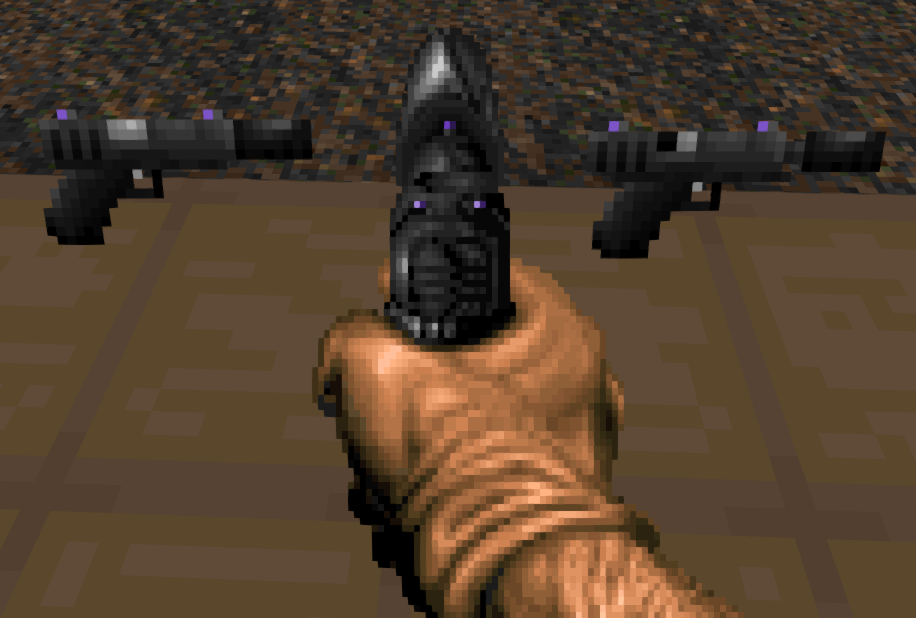  
_Credits:  
HUD Sprites: JoeyTD & Minigunner ([Realm667](https://www.realm667.com/en/armory-mainmenu-157-97317/doom-style-mainmenu-158-94349/996-glock-18))  
Silencer: Swampyrad  
Pickup Sprites: Toast  
Fireselect Graphic: Combine Kegan_

#### Revolvers
_Scoped Revolver requires [Peppergrinder](https://gitlab.com/hdiscord-saltmines/hd-peppergrinder)_

The Revolver's main body and Ironsights have been recolored, which also applies to the Peppergrinder Scoped Revolver.

  

_Credits:  
Revolver Base: Scuba Steve  
Scope: PrettyFist, Sonik.O_

#### SMG

The SMG has been swapped out with something a bit more modern and sleek, as well as have its ironsights variant recolored for thematic consistency.

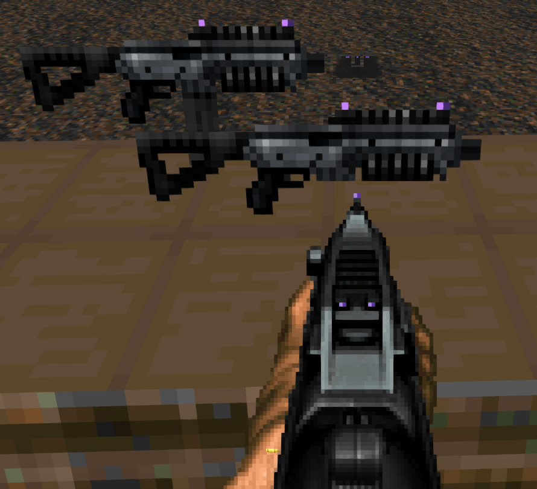  
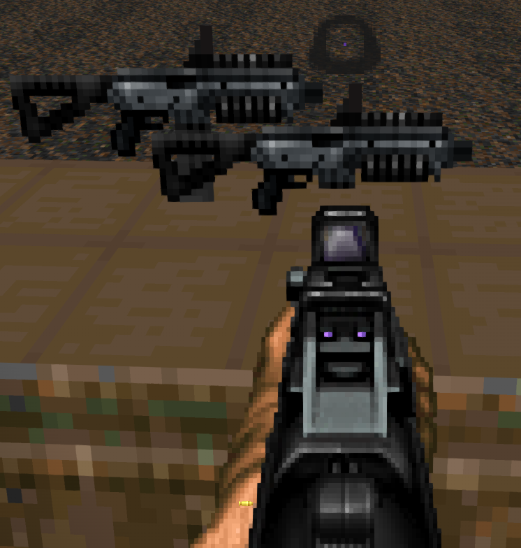  
_Credits:  
HUD Sprites: ZikShadow, Jeimuzu, DoomNukem  
Pickup Sprites: ZikShadow, DoomNukem_

#### Arkoudi Revolver Shotgun
_Arkoudi Revolver Shotgun requires [Potetobloke's Weapon Pack](https://cdn.discordapp.com/attachments/713246305392001055/1017590614365323295/PB-Mohl_HDAddon_WeaponPack_4.8.2a_RC2a.pk3)_

The Arkoudi Revolver Shotgun's ironsights have been recolored.

  
_Credits: AdianoTMO69_

#### Hunter Shotgun
The hunter has been swapped out with Complex Doom's Shotgun sprites, then recolored to match thematically.

  
_Credits:  
HUD Sprites: Daedalus, Neoworm  
Pickup Sprite: ZikShadow, Daedalus ([Complex Doom](https://forum.zdoom.org/viewtopic.php?t=58535))_

#### ZM-66 Assault Rifle
The ZM-66 has been swapped out with an older version of its HUD & pickup sprites, then had its scope lens recolored to match thematically.

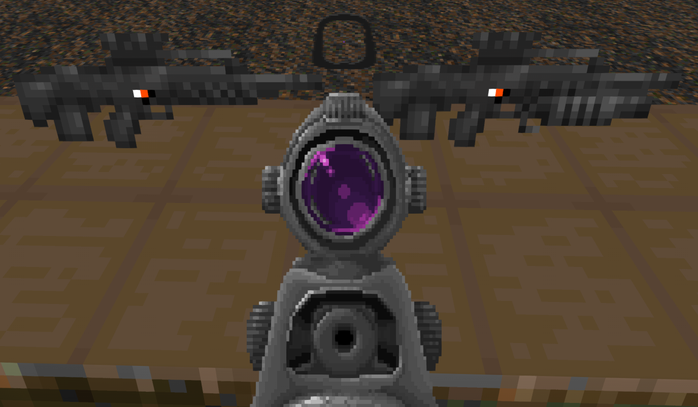  
_Credits:  
HUD & Pickup Sprites: Matt  
Fireselect Graphic: Combine Kegan_

#### Vulcanette
The Vulcanette has been swapped out to give it a much more fitting, hefty minigun feeling.

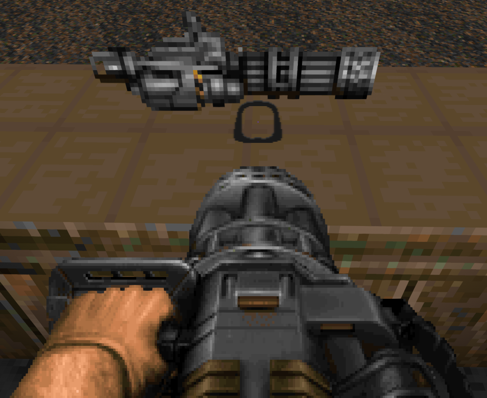  
_Credits: Sonik.O_

H.E.R.P. Changes
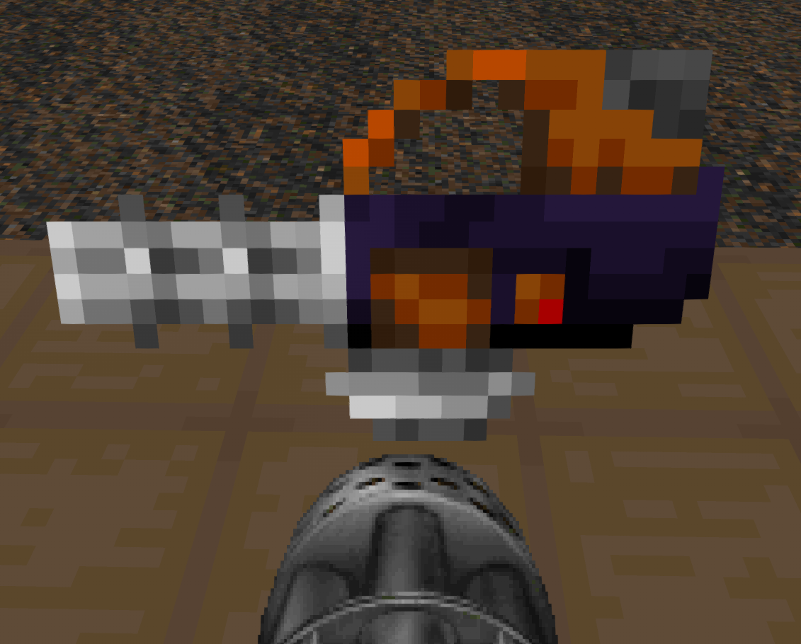

#### Liberator Battle Rifle
The Liberator has been swapped out with an older version of its HUD & pickup sprites, then had its scope lens recolored to match thematically.

  
_Credits:  
HUD & Pickup Sprites: Matt  
Fireselect Graphic: Combine Kegan_

#### Blooper Grenade Launcher
The Blooper has been swapped out for a Break-Action Grenade Launcher by Sonik.O.

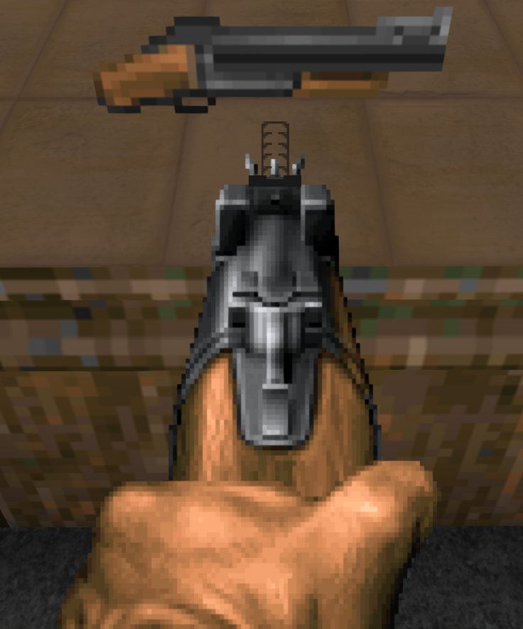  
_Credits: Toast, Sonik.O_

#### Brontornis
The Brontornis' Ironsight dot has been updated to match the default Front Sight sprite.

  
_Credits: Matt_

#### 10mm Pistol
_Requires [Radtech Weapons Pack](https://github.com/swampyrad/RadTechWeaponsPack)_

The 10mm Pistol's rear Ironsight dots have been recolored to match the default Sight sprites.

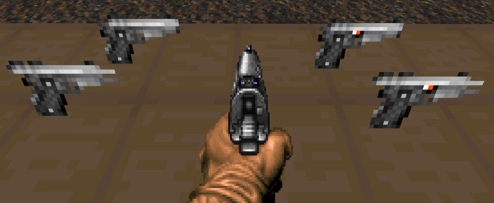  
_Credits:  
HUD & Pkcup Sprites: Chopblock223, [Freedoom](https://freedoom.github.io/)  
Fireselect Graphic: Combine Kegan_

#### Phazer
_Requires [Radtech Weapons Pack](https://github.com/swampyrad/RadTechWeaponsPack)_

The Phazer has been swapped out with a more fitting D-93 Plasma Pistol.

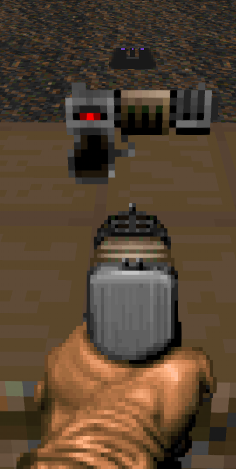  
_Credits: [UNKNOWN](#UNKNOWN-CREDITS)_

#### Obrozz Pistol
_Requires [Radtech Weapons Pack](https://github.com/swampyrad/RadTechWeaponsPack)_

The Obrozz Pistol's scope lens has been recolored to differentiate it from the base Boss as well as match thematically.

  
_Credits: Swampyrad_

#### Greely
_Requires [Peppergrinder](https://gitlab.com/hdiscord-saltmines/hd-peppergrinder)_

The Greely's main body has been recolored ~~so Player 2 can have a turn~~ to match thematically.

  
_Credits:  
HUD Sprites: AdianoTMO69, PrettyFist  
Pickup Sprites: PrettyFist_

#### Sawed-Off Slayer
_Requires [Peppergrinder](https://gitlab.com/hdiscord-saltmines/hd-peppergrinder)_

The Sawed-Off Slayer has been given a set of sprites to help it feel more hand-held.

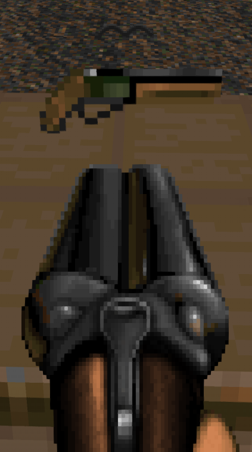  
_Credits: Toast, id Software, CardboardMarty, JoeyTD, Neoworm, YukesVonFaust, Sonik.O, ChopBlock223_

#### Combat Shotgun
_Requires [Radtech Weapons Pack](https://github.com/swampyrad/RadTechWeaponsPack)_

The Combat Shotgun has been swapped out with the Duke3D Shotgun, which as then had its ironsights recolored to match the reticle colors.

  
_Credits: JoeyTD, Minigunner ([Realm667](https://www.realm667.com/en/armory-mainmenu-157-97317/doom-style-mainmenu-158-94349/841-duke-shotgun))_

#### TRO-G AR
_Requires [Peppergrinder](https://gitlab.com/hdiscord-saltmines/hd-peppergrinder)_

The TRO-G has had its front ironsight modified to match thematically.

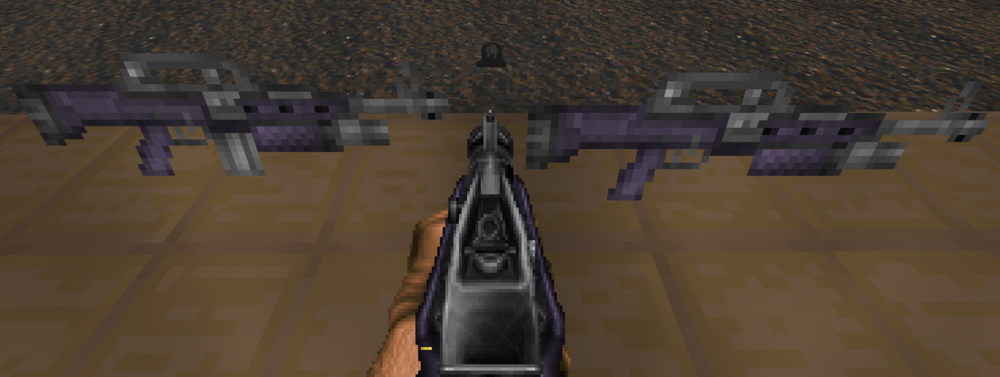  
_Credits: A1337Spy, HyperUltra64, Sledge, Chopblock223_

#### Vera
_Requires [Peppergrinder](https://gitlab.com/hdiscord-saltmines/hd-peppergrinder)_

The Vera has had its Ironsight dots recolored to match its reticle sprites, as well as have its ammo box & stock recolored to match thematically.

_Credits: Ultra64_

#### BreakerTek P90
_Requires [Peppergrinder](https://gitlab.com/hdiscord-saltmines/hd-peppergrinder)_

The P90 has had its sight dot recolored to match the reticle color.

  
_Credits: Prettyfist_

#### ZM94 "Sniperwolf" Anti-Material Rifle
_Requires [Peppergrinder](https://gitlab.com/hdiscord-saltmines/hd-peppergrinder)_

The ZM94 has been swapped out with the [ZM69](https://forum.zdoom.org/viewtopic.php?f=43&t=66091) Sniper Rifle sprites, as well as have its scope lens recolored to match thematically.

  
_Credits: Tartlman, Matt_

#### Iron Sights Boss Rifle
_Requires [Hexadoken's Legacy Continued](https://github.com/Gay-Snake-Squad/HexaDoken-Legacy-Continued)_

The Scopeless Boss Rifle has had its Ironsight dots recolored to match the reticle sight sprites.

  
_Credits: HexaDoken_

#### Six-12 Shotgun
_Requires [Six12](https://gitlab.com/icarus-innovations/hdest-addons/six12)_

The Six12 Shotgun has been replaced with one made by Sonik.O.

  
_Credits: Sonik.O_

#### PD-42
_Requires [PD42](https://gitlab.com/icarus-innovations/hdest-addons/pd-42)_

The PD-42's body has been recolored to give better visual contrast between it and the player's gloves, as well match thematically.  The Ironsight dot has also been updated to match the crosshair color.

  
_Credits: Icarus, Railgunner_

### Item Sprite Changes

#### Light-amp Goggles

The Light-amp Goggles have been replaced to feel more tactical

  
_Credits: osjclatchford_

#### HUD Helmet
_Requires [Hideous Helmet](https://forum.zdoom.org/viewtopic.php?f=43&t=71950)_

The HUD Helmet has been replaced to match the mugshots provided by HUD Helmet.

  
Credits: Mephresfire_

#### Micro-Cell
_Requires [Radtech Weapons Pack](https://github.com/swampyrad/RadTechWeaponsPack)_

The Micro-cell has been replaced to feel more like a conventional cylindrical battery

  
_Credits: osjclatchford_

#### Garrison Armor
The Garrison Armor has been replaced to give it a more "all-purpose" feel.

  
_[DRLA Credits](#DRLA-Credits): SoloSpaghetti ([DRLA](https://forum.zdoom.org/viewtopic.php?t=37044))_

#### Leather Jacket
_Requires [Radtech Items Pack](https://github.com/swampyrad/RadTechItemPack)_

The Leather Jacket has been replaced to feel more "Space Cowboy".

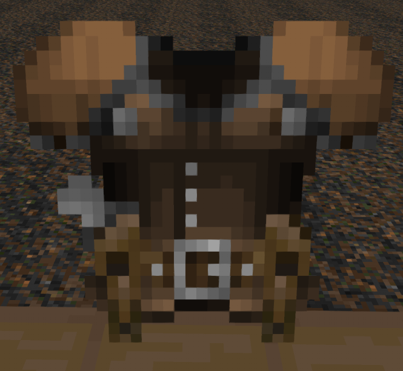  
_[DRLA Credits](#DRLA-Credits): SoloSpaghetti ([DRLA](https://forum.zdoom.org/viewtopic.php?t=37044))_

#### Sneaking Suit
_Requires [Sneaking Suit](https://codeberg.org/Wanzer/HDst_WAN_SneakingSuit)_

The Sneaking Suit has been replaced to fit the dimensions of the rest of the armors while also giving it a more lightweight/tactical feel.

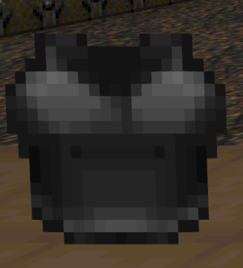  
_[DRLA Credits](#DRLA-Credits): SoloSpaghetti ([DRLA](https://forum.zdoom.org/viewtopic.php?t=37044))_

#### UAC Corporate Armor
_Requires [UAC Corporate Armor](https://codeberg.org/TwelveEyes/hd_uacarmour/)_

The UAC Corporate Armor has been replaced to give it a more "tech-armor" feel.

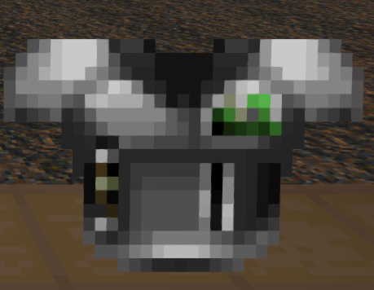  
_Credits: Ghastly Dragon ([Pandemonia](https://forum.zdoom.org/viewtopic.php?t=60984) )_

#### HEV Armor
_Requires [HEV Armor](https://gitlab.com/icarus-innovations/hdest-addons/hev-armor)_

The HEV Armor has been replaced to make it less of a simple recolor.

  
_Credits: Lightsource ([Pandemonia](https://forum.zdoom.org/viewtopic.php?t=60984) )_

#### Field Assembly Kit
_Requires [Cozi's Offworld Wares](https://github.com/Deadondev/Cozis-Offworld-Wares)_

The Field Assembly Kit crate has been replaced to preserve the UAC logo, rather than Ace's personal logo.

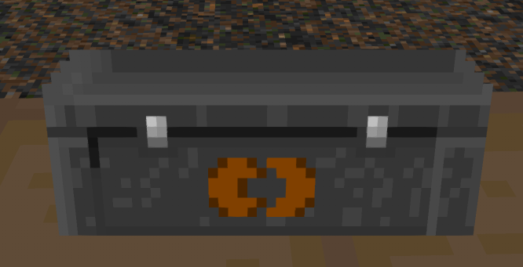  
_Credits: Yholl, id Software_

#### Medical Bag
_Requires [Cozi's Offworld Wares](https://github.com/Deadondev/Cozis-Offworld-Wares)_

The Medical Bag always felt off to be carrying multiple "full-size" backpacks alongside the main backpack.  Instead, it has been swapped out with one that more closely resembles the Ammo Pouch.

  
_Credits: Zrrion_

#### Logistics Bag
_Requires [Cozi's Offworld Wares](https://github.com/Deadondev/Cozis-Offworld-Wares)_

The Logistics Bag also always felt off to be carrying multiple "full-size" backpacks alongside the main backpack.  Instead, it has been swapped out with the original "Gunsmith Pouch" from the mod of the same name, so that it more closely resembles the Ammo Pouch.

  
_Credits: Skelegant ([Gunsmith Pouch](https://dastrukar.gitlab.io/hddons-list/#utilities:gunsmithpouch-mohl))_

---

### Other Changes

#### Cacodemon
When playing id Doom, the cacodemon's death animation has been replaced with one that feels much more electrifying, given their proclivity to emit sparks when dead.

  
_Credits: Robo_Cola, id Software_

#### HUD Helmet Backgrounds
_Requires [Hideous Helmet Extended]()_

The various Preset HUD Backgrounds have all been recolored to match thematically.

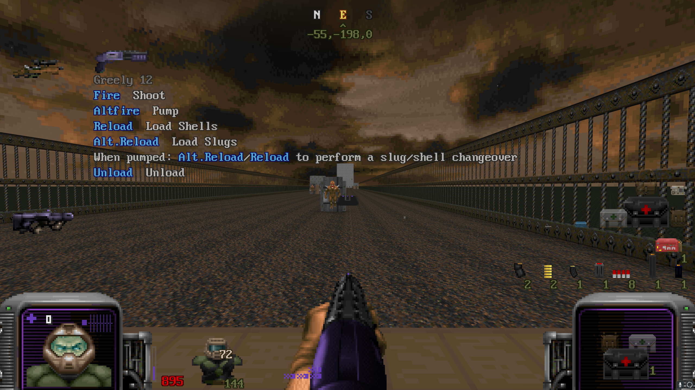
_Credits: Toast, id Software, Sgt. Kiwi, Arcterezion_  

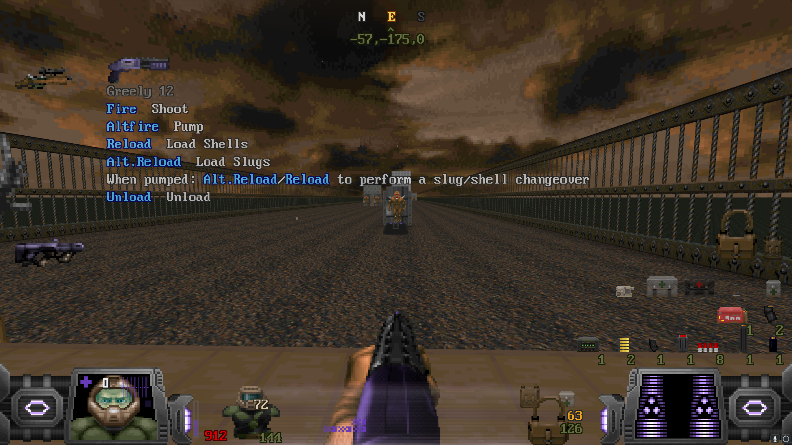  
_Credits: Arcterezion_  

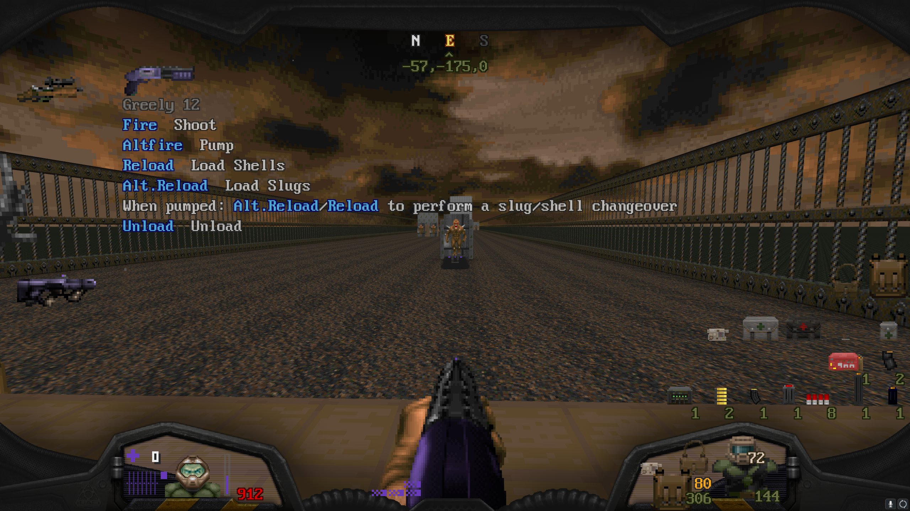  
_Credits: Saegiru, WildWeasel, 2800fps_  

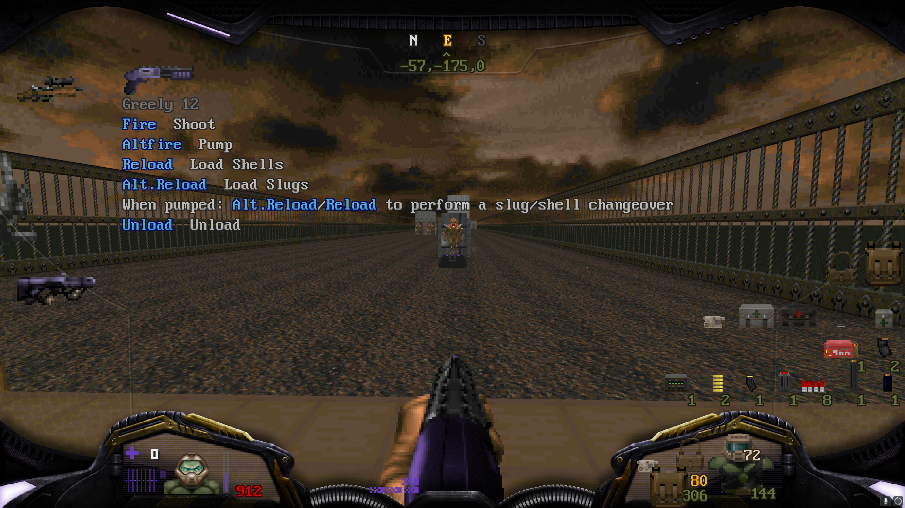
_Credits: Saegiru, WildWeasel, 2800fps, Lightsource_  

---
## Special Thanks

- Matt, for creating Hideous Destructor itself
- Dizzy, for giving me the inspiration to make my own HDest Addon
- All of those who created the assets used in this pack.
	- Image credits have been listed under their respective screenshots

### DRLA Credits
_Assets used from [DRLA](https://forum.zdoom.org/viewtopic.php?t=37044) have been done so with permission.  
**PERMISSION FROM DRLA AUTHORS IS REQUIRED TO RE-USE THEM**_

- **SoloSpaghetti**, for the Bulletproof Vest sprite (Sneaking Suit), the Tactical Armor sprite (Garrison Armor), and the Western Armor sprite (Leather Jacket)

### UNKNOWN CREDITS
_I've tried finding the original owner for these assets and have come up empty.  
If you are or know the owner, please let me know to correct them._

- The Plasma Pistol HUD & pickup sprites (Phazer).  These were taken from DRLA, but I have been informed they were not made for DRLA and the original ownership has been lost.
