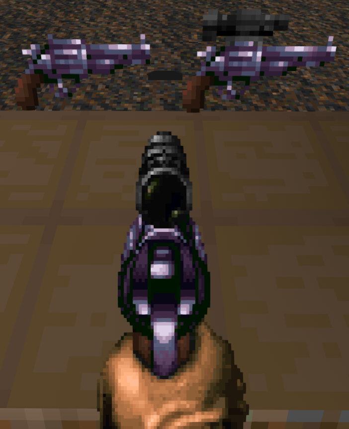

# UZ's Hideous Destructor Addon

This is my personal collection of recolor/resprite/resound assets for the GZDoom gameplay mod, "Hideous Destructor".  As it's my personal collection of changes, there are several various mods it makes changes to.

## Recolored Ironsights:

Default Hideous Destructor Front & Back Ironsights

## Recolored Weapons:

### Revolver
_Scoped Revolver requires Peppergrinder_

 

### Brontornis

### 10mm Pistol
_Requires Radtech Weapons Pack_

### Obrozz Pistol
_Requires Radtech Weapons Pack_

### Greely
_Requires Peppergrinder_

### Vera 
_Requires Peppergrinder_

### BreakerTek P90 
_Requires Peppergrinder_

### Scopeless Boss Rifle 
_Requires Hexadoken's Legacy Continued_

### Six-12 Shotgun
_Requires Six12_

### PD-42
_Requires PD42_

## Credits:

- Matt, for creating Hideous Destructor itself, including the Brontornis HUD Sprites as well as the default ironsight sprites
- Dizzy, for giving me the inspiration to make my own HDest Addon
- PrettyFist, for the Greely pickup & HUD sprites, as well as the P90 HUD & ironsight sprites, as well as the modified versions of Sonik.O's Scoped Revolver sprites
- AdianoTMO69, for the Shortened version of PrettyFist's Greely HUD sprites
- HexaDoken, for the Boss Variants' ironsight & HUD sprites
- Icarus, for modified versions of Sonik.O/Railgunner Original Six12 sprites, as well as the PD-42's HUD sprites & Pickup sprites modified from various pickup sprites from Railgunner
- Swampyrad, for the Obrozz HUD sprites
- ChopBlock223, for the 10mm Pistol HUD Sprites based off of FreeDoom's Pistol Sprites
- Ultra64, for the Vera ironsight & HUD sprites
- Scuba Steve for the original Revolver sprites
- A1337Spy, for the TRO-G ironsight sprite